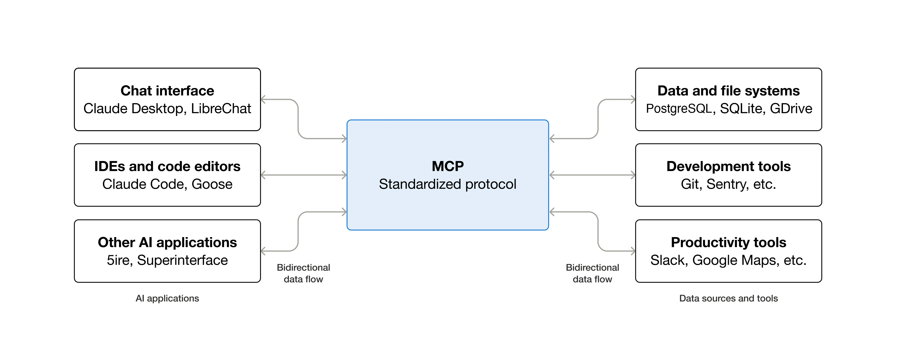

# Model Context Protocol

> One-liner: MCP is a standard interface that lets AI applications connect to tools, data sources, and external context in a uniform way.

---

## Why MCP exists

Before MCP, every AI product had to invent its own integration pattern.

- A coding assistant needed custom connectors for files, Git history, browser data, and internal APIs.
- Each IDE or agent had its own tool API, which made interoperability difficult.
- Engineers repeatedly built the same plumbing for context retrieval and tool calling.

This fragmentation made AI systems harder to scale and harder to compose.

## What MCP actually is

MCP stands for:

- Model: the LLM or AI application doing the reasoning
- Context: the extra information the model needs at runtime
- Protocol: the shared rules for requesting and exchanging that context

Anthropic introduced MCP to make tool access and context plumbing more standardized.

## Mental model

Think of MCP as a common USB-C-style connector for AI systems.

- The host application, such as Claude Desktop, Cursor, or a custom agent, acts as the client.
- MCP servers expose capabilities such as tools, resources, or prompts.
- The client can connect to multiple servers without rewriting each integration from scratch.

## Why this matters for coding assistants

An AI IDE can use different MCP servers for different jobs:

- one server for local files and Git history
- one server for documentation or web search
- one server for Jira, Slack, or a database

That turns the IDE from a chatbot into a more grounded engineering assistant.

## Key takeaway

MCP does not replace the model. It gives the model a standard way to access the right context at the right time.
