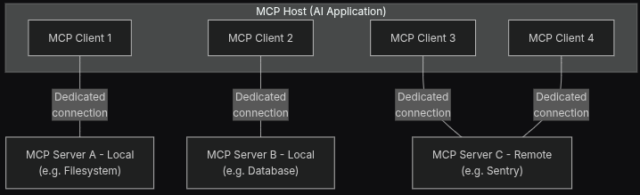
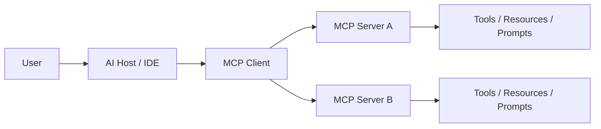

# MCP Architecture and Data Flow

> The core idea is simple: the AI app asks for capabilities, and MCP servers expose them through a standard protocol.

---

## Architecture at a glance

The architecture is built around three main roles:

- Host: the AI application that owns the user session, such as Claude Desktop, Cursor, or a custom agent
- MCP client: the component inside the host that connects to an MCP server
- MCP server: a provider of tools, resources, or prompts

A single host can talk to multiple MCP servers at the same time.

## What the diagram is showing

The image is essentially a multi-client, multi-server view of MCP:

- multiple MCP clients are attached to one host or ecosystem
- each client can connect to one or more MCP servers
- each server exposes a distinct capability surface

In practice, that means an IDE can combine several specialized integrations:

- one server for file system access
- one server for documentation search
- one server for GitHub issues or repository data
- one server for a database or internal API

## Main components

### 1. Host
The host is the product experience the user sees.

Examples:

- Claude Desktop
- Cursor
- VS Code extensions
- custom agent runtimes

### 2. MCP client
The client is responsible for negotiating capabilities and sending requests over the transport layer.

### 3. MCP server
The server exposes structured capabilities such as:

- Tools: executable actions, such as fetching weather, searching docs, or running a command
- Resources: read-only data, such as files, database rows, or API content
- Prompts: reusable prompt templates or instruction bundles

### 4. Transport
The transport carries messages between the client and server.

Common options include:

- STDIO: best for local integrations on the same machine
- SSE or streamable HTTP: better for remote or networked deployments

## Flow

## Why this architecture is powerful

This design makes the AI system more modular.

- You can add new capabilities without rewriting the host application.
- Different teams can own different MCP servers.
- The same client can use many providers, which makes the AI experience more intelligent.

## Key takeaway

MCP is not just a single server. It is a standard way for an AI host to connect to many small capability providers and combine them into one experience.
