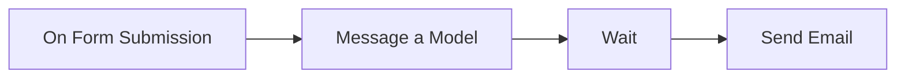
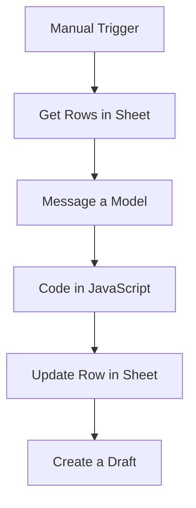
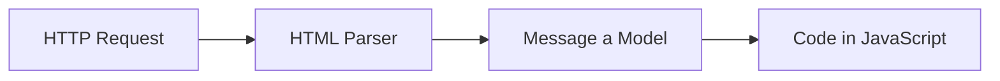
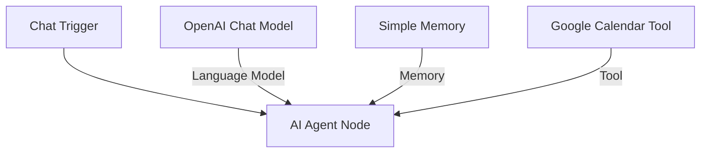
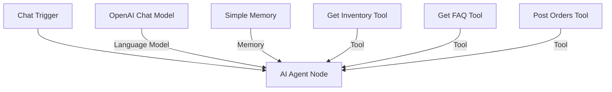

# n8n Hands-on Workflows Analysis

Below is a detailed breakdown of the 4 workflows implemented in this hands-on project.

---

## Workflow 1: n8n-Beginner (Form Fill → AI Autoresponder)

### A. High-Level Goal
Trigger a workflow on user form submission, draft a personalized response using an LLM, wait for a specified delay, and email the output to the user.

### B. Core Node Structure

1.  **Form Trigger (`On form submission`):** A custom onboarding form capturing:
    *   `First Name` (Required)
    *   `Last Name` (Required)
    *   `Email` (Required)
    *   `Phone No.`
2.  **AI Node (`Message a model`):** Calls an OpenAI model (`gpt-5-mini` / `gpt-4o-mini`) using a system prompt that structures a custom email response matching a template (e.g., *Hey {First Name}, Thanks for submitting...*).
3.  **Utility Node (`Wait`):** Implements a **120-second delay** before sending the message (simulating a natural response time).
4.  **Action Node (`Send a message1`):** Sends the generated response to `aadicodingvs@gmail.com` using the **Gmail OAuth2 API**.

---

## Workflow 2: Foundational Concepts (Prospect Lead Personalization)

### A. High-Level Goal
Fetch prospect info from a Google Sheet, personalize a cold email draft using an LLM, write the copy back to the sheet, and create a draft in Gmail.

### B. Core Node Structure

1.  **Trigger:** Manual execution trigger.
2.  **Fetch Node (`Get row(s) in sheet`):** Reads prospect records from a Google Sheet ("N8n Sample Sheet") containing LinkedIn profile data (`Title`, `Company`, `Summary`, `Industry`, `Location`).
3.  **AI Node (`Message a model`):** Instructs OpenAI to parse the prospect details and generate a personalized email divided into 5 distinct fields: `subjectLine`, `icebreaker`, `elevatorPitch`, `callToAction`, and `ps`. It is instructed to output the result as a raw JSON string.
4.  **JavaScript Node (`Code in JavaScript`):**
    *   Parses the raw JSON string returned by the LLM: `JSON.parse(original["content"][0]["text"])`.
    *   Merges it back into the stream data array so downstream nodes can map variables easily.
5.  **Write Node (`Update row in sheet`):** Writes the generated email segments (`subject line`, `icebreaker`, `elevator pitch`, `call to action`, `PS field`) back into the corresponding prospect row using the `Email` field as the matching column.
6.  **Action Node (`Create a draft`):** Creates a draft email in Gmail under the user's account for review before sending.

---

## Workflow 3: HTTP, Webhook, and AI (Web Scraping & Advanced AI Agents)

### A. High-Level Goal
This workspace showcases two concepts:
1.  **Web Scraping & Summarization:** Fetch website source code, parse its text, and use AI to extract core business points.
2.  **Interactive AI Agent:** An autonomous chat assistant with memory and external tools (Google Calendar scheduling).

### B. Node Structures

#### 1. Web Scraping Branch

*   **HTTP Request:** Performs a GET request to scrape `https://leftclick.ai/`.
*   **HTML Extractor:** Uses CSS selectors (`h1, h2, h3, h4, h5, h6, p`) to isolate readable text.
*   **OpenAI Summarizer:** Processes the page content and yields structured JSON: `{"summary": "", "threeUniquePoints": [], "contactInfoIfAny": [{}]}`.

#### 2. Advanced AI Agent Branch

*   **Chat Trigger:** Captures incoming messages from a chat interface.
*   **AI Agent (LangChain):** Acts as the brains of the execution.
*   **OpenAI Chat Model (`gpt-4o-mini`):** Drives reasoning.
*   **Simple Memory (`Buffer Window`):** Maintains context history for up to 10 dialogue rounds.
*   **Google Calendar Tool:** Allows the AI Agent to dynamically call the Google Calendar API to query, retrieve, or list events based on the user's booking requests.

---

## Workflow 4: WhatsApp Chatbot (Prasthan Restaurant Food Assistant)

### A. High-Level Goal
Deploy an autonomous AI Agent via WhatsApp to act as a smart food ordering and support assistant for "Prasthan Restaurant" linked to Google Sheets for inventory, FAQs, and order processing.

### B. Core Node Structure

1.  **Trigger:** Chat Trigger captures customer messages.
2.  **AI Agent with Prompts:** Contains strict behavioral rules:
    *   Greet users and prompt choices: *🛒 Place an order, ℹ️ FAQ / Information, 📦 Check order / stock*.
    *   Check database inventory before confirming food items.
    *   Append order details directly to the `Orders` database.
    *   Direct order cancellations to human staff support.
3.  **Connected Tools (Google Sheets):**
    *   **Get Inventory:** Fetches the spreadsheet containing food stock levels.
    *   **Get FAQ:** Consults a sheet containing answers to shipping, pricing, and operating times.
    *   **Post Orders:** Appends a new order row containing `Customer Name`, `Food Item`, `Quantity Ordered`, `Status` (Confirmed/Rejected), and `Order Date`.
4.  **WhatsApp Integration:** Uses a dedicated `WhatsApp Trigger` and `Send message` node connected to the official Meta WhatsApp API to receive and push messages.
