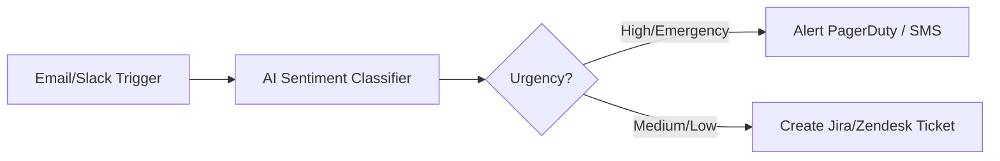
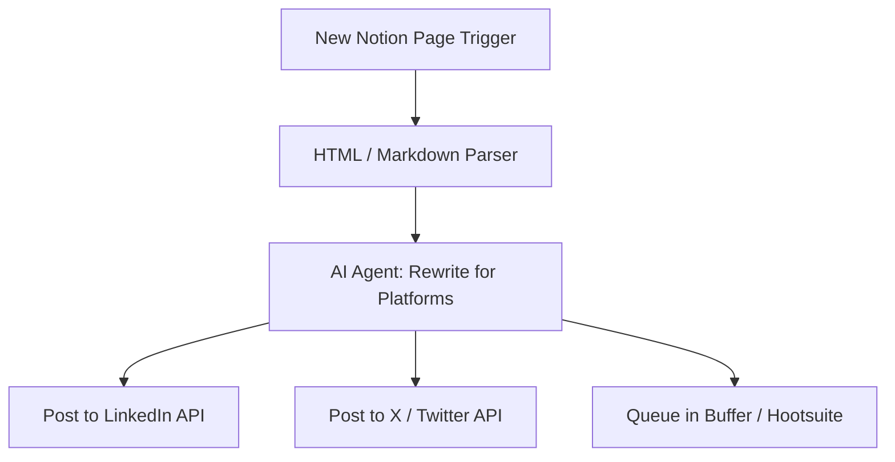
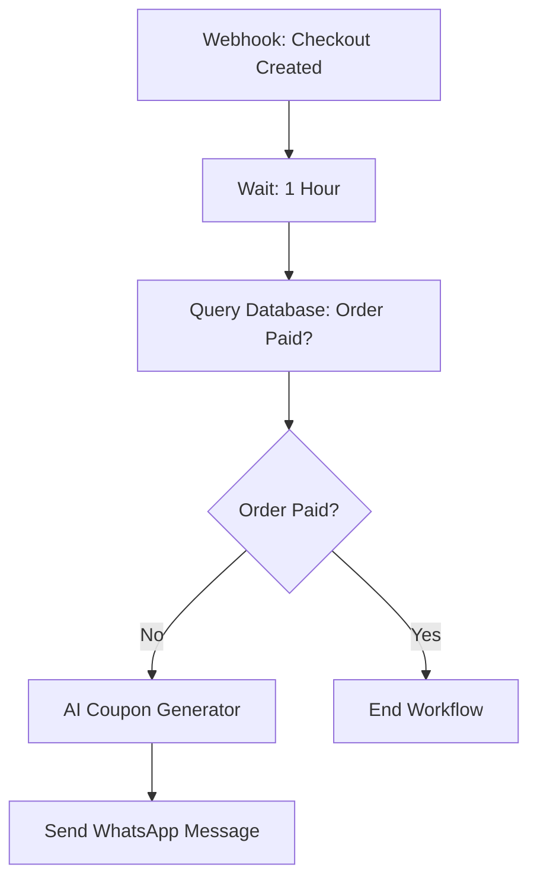
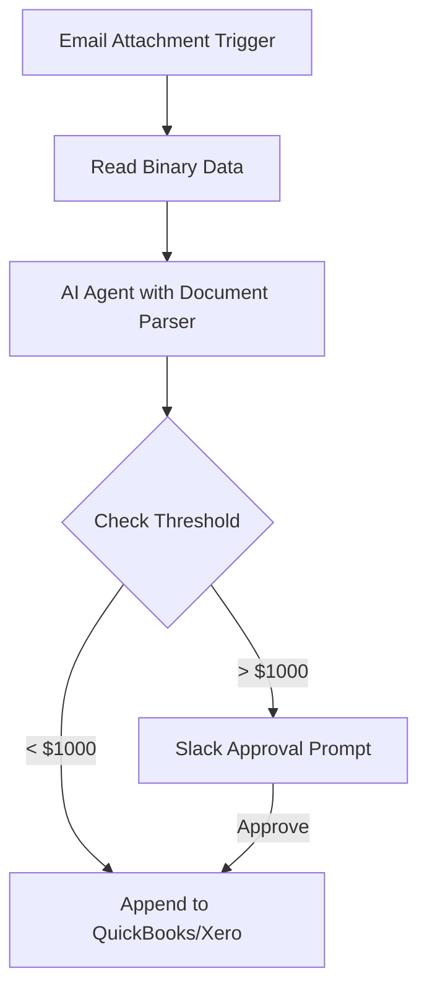
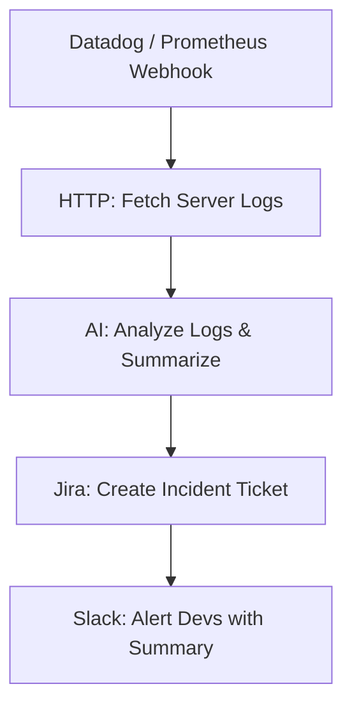

# Real-Life Automation Scenarios with n8n

n8n is an excellent tool for automating operations across engineering, sales, support, and marketing. Here are five practical, production-ready, real-life architecture patterns:

---

## 1. Automated Support Ticket Escalation & Sentiment Analysis

### Scenario
A company wants to monitor all inbound support requests (emails, Slack messages, contact forms), classify their urgency/sentiment, and page on-call engineers if there is a severe system-down incident.

### How it works in n8n

1.  **Triggers:** Gmail node (new emails) or Slack Webhook node (customer feedback channel).
2.  **AI Classification:** LangChain OpenAI model categorizes message sentiment (Positive, Neutral, Urgent, Frustrated) and extracts key issues.
3.  **Routing Logic (`Switch` Node):**
    *   **Urgent & Critical (e.g., "production down"):** Triggers `PagerDuty` or `Twilio SMS` nodes to call on-call engineers immediately.
    *   **Standard Tickets:** Routes to the `Jira` or `Zendesk` node to create a support ticket.

---

## 2. Multi-Channel Social Media Distribution Engine

### Scenario
Content creators or marketing teams want to publish a single article (on Notion, WordPress, or RSS) and automatically re-format and schedule it as posts tailored for X (Twitter), LinkedIn, and Instagram.

### How it works in n8n

1.  **Trigger:** Notion node (tracks when a page changes status to "Published").
2.  **Content Parsing:** Extracts title, tags, and page content.
3.  **AI Agent Customization:** An OpenAI chat model is prompted to:
    *   Rewrite the post as a short-form thread for **X (Twitter)**.
    *   Rewrite as a professional summary for **LinkedIn**.
    *   Extract hashtags and image prompts for **Instagram**.
4.  **Publishing:** Connects to LinkedIn, X (Twitter), and Pinterest nodes to distribute the content simultaneously.

---

## 3. Abandoned Cart Recovery & CRM Sync

### Scenario
An e-commerce business wants to track when users add items to a shopping cart but do not complete the purchase within one hour, then trigger a personalized WhatsApp/email coupon offer.

### How it works in n8n

1.  **Trigger:** Webhook node (Shopify/WooCommerce triggers `checkout_created`).
2.  **Delay Node:** A `Wait` node delays the flow for 1 hour.
3.  **Database Lookup:** Checks if a corresponding order has been completed in the PostgreSQL or Shopify database.
4.  **Condition Node:** If the payment status is still "pending":
    *   An LLM is triggered to create a personalized recovery message.
    *   Sends a message via the `WhatsApp` or `Twilio` node offering a discount coupon.
    *   Updates the user's record in `HubSpot` or `Salesforce` to "High Intent - Abandoned Cart".

---

## 4. AI-Powered Expense & Invoice Processing

### Scenario
Finance teams waste hours manually entering receipt and invoice data into accounting systems. The goal is to automatically parse incoming invoice attachments and log details into bookkeeping software.

### How it works in n8n

1.  **Trigger:** Gmail node filters for incoming emails containing "invoice" or "receipt" in the subject line.
2.  **Binary Extraction:** Reads the attached PDF/Image.
3.  **AI Extraction Tool:** Passes the document to an OCR/AI tool (like Google Cloud Document AI, Claude, or GPT-4o) to extract invoice number, merchant name, line items, total amount, and tax.
4.  **Approval Branching:**
    *   If the invoice total is under $1,000, it is automatically written to **QuickBooks** or **Xero**.
    *   If the total is over $1,000, n8n sends an interactive **Slack approval button**. Clicking "Approve" resumes the workflow and logs it into the database.

---

## 5. Automated System Health & Incident Reporting

### Scenario
DevOps engineers need a system that monitors backend server alerts, summarizes logs, raises incident tickets, pages staff, and writes a diagnostic summary back to the incident channel.

### How it works in n8n

1.  **Trigger:** Webhook listener receives alerts from Datadog, Prometheus, or Grafana.
2.  **HTTP Request Node:** Automatically queries the server's API to pull the last 100 lines of error logs.
3.  **AI summarizer:** Summarizes the logs to identify the exact exception or stack trace.
4.  **Jira Integration:** Automatically creates a high-priority incident ticket.
5.  **Slack Integration:** Pushes a formatted alert block containing the diagnostic summary, affected endpoints, and the Jira ticket link to the `#dev-alerts` channel.
