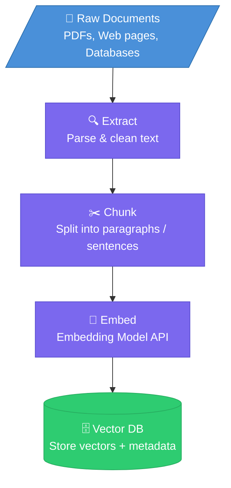
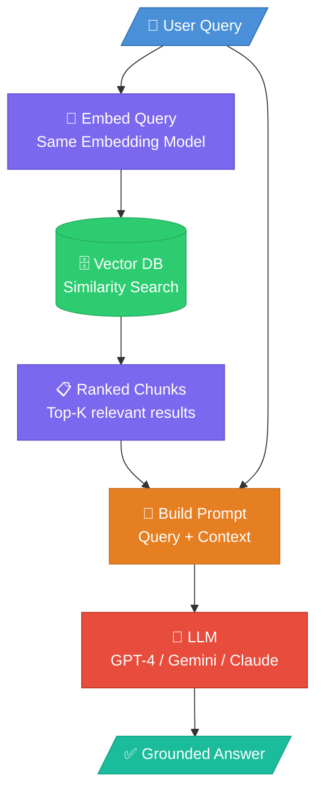

# RAG Pipeline

The pipeline has **two phases**: Ingestion (done once / on updates) and Retrieval (done per query).

---

## 1. Ingestion Pipeline

Runs **offline** to prepare your knowledge base.

---

## 2. Retrieval Pipeline

Runs **online** for every user query.

---

## Key Components & Tool Choices

| Component | What it does | Popular Tools |
|---|---|---|
| **Chunking** | Splits documents into digestible pieces | LangChain, LlamaIndex |
| **Embedding Model** | Converts text → numerical vectors | OpenAI `text-embedding-3`, Gemini Embeddings |
| **Vector DB** | Stores & searches vectors by similarity | Chroma DB, Pinecone, Weaviate, FAISS |
| **LLM** | Generates the final answer | GPT-4, Gemini, Claude |

---

## Chunking Strategies (Quick Reference)

| Strategy | Best for |
|---|---|
| Fixed-size (tokens) | Simple, fast baseline |
| Sentence / Paragraph | Preserves natural context |
| Semantic chunking | Groups by meaning, not just size |
| Recursive character | LangChain default, works well generally |
