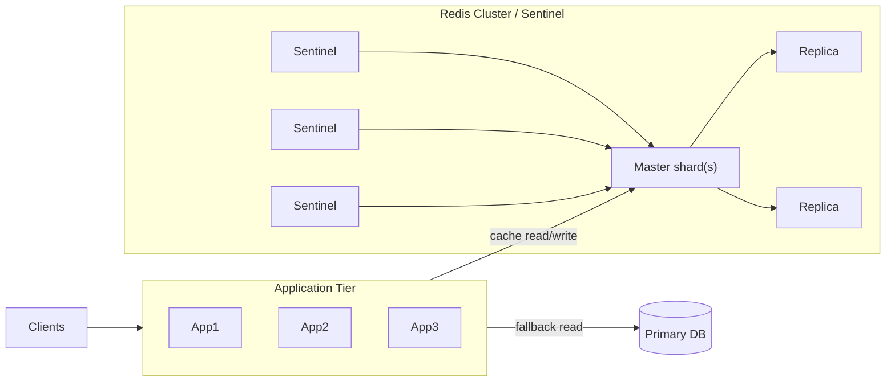

## Redis — definition & quick summary

Redis is an in-memory data-structure store used as a distributed cache, session store, lightweight stream/event log, and transient message broker. This note focuses on practical production usage: configuration, operational commands, caching patterns, and runbook actions.

---

## Quick reference commands

Run locally:

```bash
redis-server /etc/redis/redis.conf
redis-cli PING
redis-cli INFO replication
redis-cli INFO memory
redis-cli MONITOR   # avoid in prod except debugging
```

Check slow log and keyspace:

```bash
redis-cli SLOWLOG GET 10
redis-cli INFO stats | egrep "keyspace_hits|keyspace_misses"
redis-cli DBSIZE
```

---

## Core data types (practical uses)

- String: cache values, feature flags, rate-limit counters (`INCR`, `EXPIRE`).
- Hash: store compact objects per key (user profiles with fields), use `HSET/HGETALL` to avoid many keys.
- List: simple queues (`LPUSH`/`BRPOP`), but prefer Streams for durability and consumer groups.
- Sorted Set: leaderboards and time-windowed scoring (`ZADD`/`ZRANGE` with scores).
- Stream: append-only event log with consumer groups (`XADD`/`XGROUP`/`XREADGROUP`). Use Streams when you need replay and durable consumers.

---

## Architecture: Redis in a typical web application



Notes:
- Use a client-side L1 cache (local library) for microsecond reads and Redis L2 for shared caching.
- For high write throughput and large datasets use Redis Cluster; for simple HA use Sentinel.

---

## Configuration snippets (redis.conf highlights)

Memory & eviction:

```
maxmemory 8gb
maxmemory-policy allkeys-lru
# for session-critical workloads use noeviction and monitor
# maxmemory-policy noeviction
```

Persistence (balanced):

```
save 900 1
save 300 10
appendonly yes
appendfsync everysec
```

Networking & security:

```
bind 127.0.0.1
requirepass <your-strong-password>
protected-mode yes
```

For cluster nodes, ensure `cluster-enabled yes` and proper `cluster-config-file` entries.

---

## Practical caching patterns (recipes)

### Cache-aside (safe default)

Python-like pseudocode:

```python
def get_user(user_id):
		key = f"user:{user_id}"
		v = redis.get(key)
		if v:
				return deserialize(v)
		# cache miss
		user = db.get_user(user_id)
		redis.set(key, serialize(user), ex=3600)
		return user
```

### Mutex to prevent stampede (SET with NX + EX)

```python
# try to acquire lock
if redis.set(lock_key, token, nx=True, ex=10):
		# generate value and write cache
		redis.set(key, value, ex=3600)
		redis.delete(lock_key)
else:
		# wait small time and read cache again
```

### Stale-while-revalidate (serve stale immediately, refresh in background)
- Store value+expiry metadata; if expired, return current value and asynchronously refresh.

Example: use a background worker or Lua script to atomically check-and-schedule refresh.

---

## Atomic helpers & Lua scripts

Use Lua to make multi-step operations atomic and cheap on server:

Rate limiter (token bucket) sketch:

```lua
-- KEYS[1]=key, ARGV[1]=limit
local current = tonumber(redis.call('GET', KEYS[1]) or '0')
if current + 1 > tonumber(ARGV[1]) then
	return 0
else
	redis.call('INCR', KEYS[1])
	redis.call('EXPIRE', KEYS[1], 1)
	return 1
end
```

Avoid long-running Lua scripts — they block the server.

---

## Streams & consumer groups (durable queue)

When you need replay and consumer coordination, prefer Streams over Lists:

- Producer: `XADD mystream * user 123 action view`
- Consumer group setup: `XGROUP CREATE mystream mygroup $`
- Consumer read: `XREADGROUP GROUP mygroup c1 COUNT 10 BLOCK 2000 STREAMS mystream >`

Use `XACK` to acknowledge, and `XPENDING`/`XCLAIM` to troubleshoot stuck messages.

---

## Monitoring & metrics (what to alert on)

- `used_memory` approaching `maxmemory` — alert at 70% and 90%.
- Eviction rate — high evictions indicate capacity problems.
- `keyspace_misses` spike — sudden cache miss storm.
- Replication lag / `master_last_io_seconds_ago` — replica lag.
- Slowlog entries — commands taking >100ms.

Use `redis_exporter` (Prometheus) and capture `redis_memory_used_bytes`, `redis_commands_processed_total`, `redis_evicted_keys_total`, `redis_slowlog_length`.

CLI quick checks:

```bash
redis-cli INFO memory
redis-cli INFO stats | egrep "keyspace_hits|keyspace_misses|evicted_keys"
redis-cli SLOWLOG GET 5
```

---

## Sizing heuristics

- Average object size × cardinality ≈ working set. Add 20–30% headroom.
- Use `MEMORY USAGE key` to estimate per-key size for sample keys.
- Network latency: keep read latencies <1–2ms for app-to-cache in same AZ.

Shard when:
- A single node's memory > 60–70% of its capacity, or
- Single-node QPS approaches 100k and latency degrades.

---

## Failover & runbook (practical steps)

If master fails (Sentinel-managed):

1. Check Sentinel status: `redis-cli -p 26379 SENTINEL masters`
2. Confirm a new master elected: `redis-cli INFO replication` on replicas.
3. If auto-failover didn't succeed, promote a replica manually: `SLAVEOF NO ONE` followed by updating application config.
4. Drain clients and reconfigure pools if necessary.

Cluster-specific:

- Use `redis-cli --cluster check` and `--cluster fix` carefully.
- Rebalance slots with `redis-cli --cluster reshard` during low traffic.

---

## Troubleshooting checklist

- High eviction rate: increase memory, change eviction policy, or reduce TTLs.
- Large number of keys: consider namespacing and using hashes to reduce key count.
- Sudden miss spike after deploy: verify cache invalidation logic and key prefixes.
- Slow commands: identify using SLOWLOG and rewrite hotspots (avoid KEYS, large HGETALL).

---

## Operational checklist (quick)

- Ensure `maxmemory` and `maxmemory-policy` set for intended workload.
- Configure persistence according to durability needs (`AOF` vs `RDB`).
- Monitor memory, evictions, replication lag, and slowlog.
- Protect admin commands via ACLs and network policies.
- Use Streams for durable consumer workflows and Lists only for simple transient queues.
- Implement cache stampede mitigations on hot keys (mutex, pre-warm, jittered TTLs, stale-while-revalidate).

---

## See also

- [Cache Stampede](5.2_Cache_Stampede.md)
- [Message Queues](../04-MQ/4.1_Message_Queue.md)
