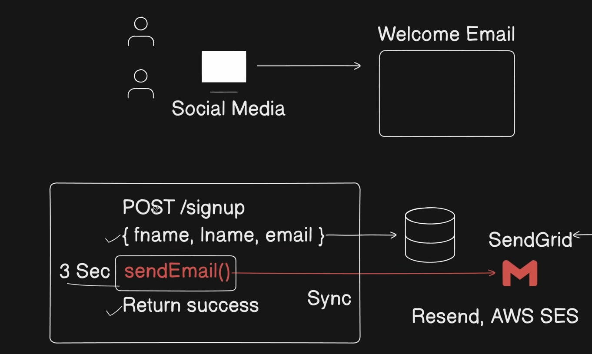
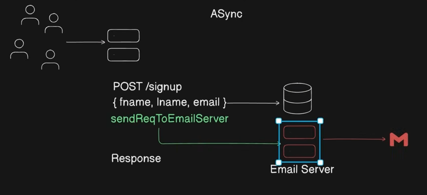
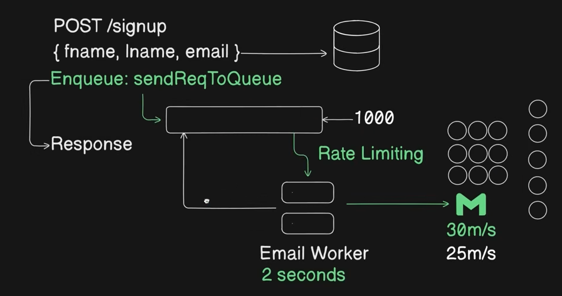
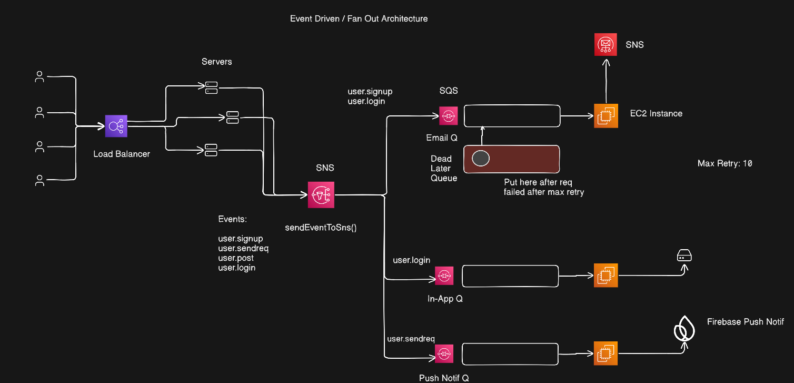

# Case Study: Notification System

---

## Requirements

**Functional**
- Send welcome email on signup
- Send notifications for: Login, Forgot Password, Friend Request, User Post
- Support In-App notifications and Push notifications

**Non-Functional**
- Signup must not be blocked by notification failures
- System must handle burst traffic (100s of concurrent signups)
- Reliable delivery — notifications should not be lost

---

## Approach 1 — Synchronous (Naive)

On signup, the server saves the user to DB and **immediately calls the external email provider (Gmail/SendGrid/AWS SES)** in the same request thread.



```
  POST /signup { fname, lname, email }
       │
       ├──► Save to DB
       │
       └──► sendEmail() ──► External Provider (Gmail / SendGrid / AWS SES)
                            Returns success (3 seconds)
       │
  Return response to user
```

**Problems:**
1. **Latency** — External API call adds ~3s to every signup response
2. **Provider downtime** — If Gmail/SendGrid is down, signup fails entirely
3. **Rate limiting** — External providers cap requests (e.g., 30/min). If 100s of users sign up simultaneously, most requests get rejected → signup crashes

---

## Approach 2 — Asynchronous (Separate Email Server)

Instead of calling the provider directly, the signup handler fires a request to a **dedicated Email Server** and immediately returns a response to the user.



```
  POST /signup { fname, lname, email }
       │
       ├──► Save to DB
       │
       └──► sendReqToEmailServer() ──► Email Server ──► External Provider
       │
  Return response immediately (no waiting)
```

**Improvement:** Signup is no longer blocked by the email provider.

**Remaining Problem:** If 100 users sign up simultaneously, the Email Server may process 30 but reject the remaining 70 — no queuing, no buffer.

---

## Approach 3 — Queue + Email Worker (Recommended Base)

Instead of sending directly to the Email Server, **enqueue** the notification request into a FIFO queue. An Email Worker picks tasks off the queue and processes them at its own pace.



```
  POST /signup { fname, lname, email }
       │
       ├──► Save to DB
       │
       └──► sendReqToQueue() ──► [FIFO Queue]
       │                               │
  Return response immediately     [Email Worker] ──► External Provider
```

**Why this works:**
- Queue enqueue is O(1) — extremely fast, never rejects requests
- 1000 signups → 1000 items in queue, none dropped
- Email Worker pulls one request at a time, respects provider rate limits

### Handling Rate Limiting from External Provider

```
  Provider allows 30 req/min.
  Email Worker hits rate limit after 30 requests.
  Worker sleeps for 2 seconds, then resumes pulling from queue.
  → Batched delivery, no requests lost.
```

### Retry Mechanism + Exponential Backoff

If the provider fails on a request, the Worker retries. To prevent an infinite retry loop:

```
  Attempt 1: retry after 1s
  Attempt 2: retry after 2s
  Attempt 3: retry after 4s
  Attempt 4: retry after 8s
  ...
  Max retries: 10 → move to Dead Letter Queue (DLQ)
```

**On failure options:**
- Discard the message (acceptable for low-priority notifications)
- Re-enqueue (for important notifications like welcome email)
- Move to **Dead Letter Queue** after max retries — inspect manually

---

## Scaling to Multiple Event Types

The signup email is one event. In a real social media app, many events need notifications:

| Event | Notification Triggered |
|---|---|
| Signup | Welcome email |
| Login | Login alert email |
| Forgot Password | Password reset email |
| Friend Request | In-app + Push notification |
| User Post | In-app notification for followers |

**Naive approach:** In each controller, call `sendReqToEmailQueue()` separately, add infra per channel.

**Problem:** Every new notification type needs code changes across multiple controllers. Adding SMS or push notification adds more scattered infra. Architecture is **only partially scalable**.

---

## Approach 4 — Event-Driven / Fan-Out Architecture (Final)

Each server action publishes a **generic event** to a central message broker (SNS). SNS **fans out** that event to the appropriate queues. Each queue has a dedicated worker for its channel.



```
  POST /signup / POST /login / POST /sendreq
       │
  [Load Balancer] ──► [Servers]
                            │
                    sendEventToSns(event)
                            │
                          [SNS]  ◄── Events: user.signup, user.login,
                         / | \                user.sendreq, user.post
                        /  |  \
                       /   |   \
              [Email Q] [In-App Q] [Push Notif Q]
                  │          │            │
            [EC2 Worker] [EC2 Worker] [EC2 Worker]
                  │          │            │
              SendGrid    In-App DB   Firebase Push
              AWS SES                  Notification
```

**How SNS Fan-Out works:**
- `user.signup` event → SNS → Email Q (welcome email)
- `user.login` event → SNS → Email Q (login alert) + In-App Q
- `user.sendreq` event → SNS → In-App Q + Push Notif Q
- `user.post` event → SNS → In-App Q + Push Notif Q

**Advantages:**
- Add a new channel (SMS, Slack) → add one queue + one worker → zero changes to app servers
- Each channel scales independently
- If push notification worker is slow, email worker is unaffected
- Dead Letter Queue per channel captures permanently failed messages after max retries (10 by default)

---

## In-App Notifications

For real-time in-app alerts (friend request, post mention), a persistent connection between client and server is needed.

**WebSocket** — bidirectional, persistent connection. Server can push events to the client instantly without the client polling.

```
  Client ◄──WebSocket──► Notification Server ◄── In-App Queue Worker
  (app open)                  (pushes event the moment it arrives)
```

---

## Push Notifications (User not in app)

When the user's app is closed or in background, use **Firebase Cloud Messaging (FCM)** (Android/iOS).

```
  Push Notif Worker ──► FCM/APNs ──► Device OS ──► Notification tray
```

---

## Intelligent Notification Delivery — Ingestion Logic

**Problem:** When the user is active on the platform, sending an email for a friend request is unnecessary noise.

**Solution:** Before triggering a notification channel, check user state via **Redis** (fast key-value lookup).

```
  Event arrives at worker
       │
  Check Redis:
  ├── Is user currently online?          → skip email, use in-app only
  ├── Is channel/chat muted?             → suppress notification entirely
  ├── Is user on Do Not Disturb (DnD)?  → queue, deliver when DnD ends
  └── Is user @mentioned directly?      → always deliver (override DnD)
```

**Notification Decision Matrix:**

| Condition | Email | In-App | Push |
|---|---|---|---|
| User is online on platform | No | Yes | No |
| User is offline | Yes | No | Yes |
| Channel muted | No | No | No |
| User on DnD | No | No | No |
| User directly @mentioned | Yes | Yes | Yes (overrides DnD) |

Redis stores user session state with a short TTL. Each worker checks this before dispatching to the external provider.

---

## Key Takeaways

- Synchronous notification tightly couples signup success to provider availability — always decouple
- Queue + Worker is the base pattern: O(1) enqueue, rate-limit safe, retry-able
- Exponential backoff prevents infinite retry loops; Dead Letter Queue catches permanently failed messages
- Event-Driven / Fan-Out (SNS + multiple queues) makes the system fully scalable — add channels without changing app code
- Use Redis to check user state before deciding which channel to use
- Always override DnD for direct @mentions — user explicitly wants that notification
