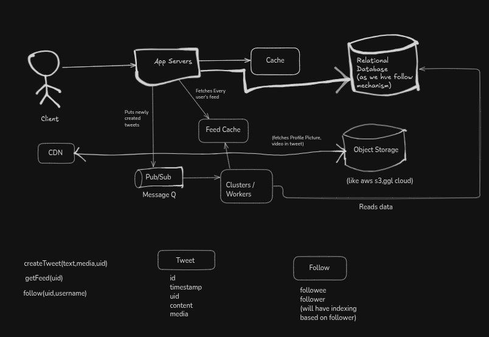

# Case Study: Twitter

---

## Requirements

**Functional**
- Users can post tweets (text + optional media)
- Users can view their feed (tweets from followed users)
- Users can follow/unfollow other users
- Tweets appear in followers' feeds in near real-time
- Support media uploads (images, videos)
- Users can search tweets (out of scope for initial design)

**Non-Functional**
- **Latency:** Feed loading < 2 seconds, tweet posting < 5 seconds
- **Availability:** 99.9% uptime across regions
- **Consistency:** Eventual consistency acceptable for feeds; strong consistency for follower counts
- **Scalability:** Handle 500M+ users, 100K+ QPS at peak
- **Durability:** No loss of tweets or follower relationships

---

## Capacity Estimation

**Scale Assumptions:**
- 500M total users, 50M DAU (Daily Active Users)
- 5 TPS (tweets per second) baseline, 100 TPS peak (10x during events)
- Average tweet size: 280 bytes text + metadata
- Media (30% of tweets): 1–5 MB per tweet
- Average user follows 1,000 people

**Storage:**
- Tweets: 50M users × 5 TPS × 86,400 sec × 30 days ≈ 6.5B tweets/month
- Metadata per tweet: ~1 KB → 6.5 TB/month
- Media: 30% × 6.5B × 2 MB avg → ~3.9 PB/month
- Follower graph: 50M users × 1,000 avg follows × 8 bytes → 400 GB

**Read Traffic:**
- 50M DAU × 10 feeds/day × 20 tweets per feed ≈ 10B feed reads/day ≈ 115K QPS
- Most reads from cache (feed cache, tweet cache)

---

## Naive Design — Synchronous Feed Generation

```
  Client: POST /tweet
       │
  [App Server]
       │
       ├──► DB: Save tweet metadata
       │
       ├──► Object Storage: Upload media
       │
       └──► For each follower:
            ├──► DB: Insert tweet into follower's feed table
            └──► Response sent after ALL followers updated
```

**Problems:**
1. **Blocking write:** A popular user with 10M followers blocks for minutes during posting
2. **Database overload:** 10M INSERT queries in a single request → timeout
3. **Hot partition:** Follower table under celebrity accounts becomes a write bottleneck
4. **Cascade failures:** If one follower update fails, entire tweet operation fails

---

## Identified Bottlenecks

1. **Follower Table Write Overload**
   - Writing directly to a single follower table for every tweet from celebrities causes lock contention
   - MyISAM/InnoDB locks at row/table level → becomes a bottleneck

2. **Synchronous Feed Population**
   - Forcing all follower updates in the request path violates single responsibility
   - User should never wait for follower updates to complete

3. **Database Can't Keep Pace with Writes**
   - At 100K QPS with 1000 followers each = 100M writes/sec to follower table
   - Even a high-performance database (Cassandra, DynamoDB) hits write limits at this scale

4. **No Fan-Out Strategy**
   - Centralizing all writes to one table creates contention
   - Need distributed fan-out across worker nodes

5. **Feed Cache Invalidation**
   - Centralized cache for all feeds → cache stampede if popular tweet goes viral
   - Need intelligent cache prefetching and lazy generation

---

## Production Architecture

```
                                 ┌─────────────┐
                                 │    CDN      │
                                 │ (media)     │
                                 └─────────────┘
                                       ▲
                                       │
┌──────────┐       ┌───────────────┐   │   ┌──────────────────────────┐
│  Client  │──────▶│  App Servers  │───┼──▶│  Object Storage          │
└──────────┘       │ (Load Bal)    │   │   │  (S3, GCS, Blob)         │
                   └───────┬────────┘   │   └──────────────────────────┘
                           │            │
                           │            ▼
                           │      ┌──────────────────┐
                      ┌────┴─────▶│  Relational DB   │
                      │    (main  │  (MySQL/Postgres)│
                      │    graph) │  - Tweet metadata│
                      │    Put    │  - Follow graph  │
                      │           └──────────────────┘
                      │
                ┌─────▼──────┐
                │ Pub/Sub or  │
                │ Message Q   │
                │ (Kafka,RMQ) │
                └─────┬──────┘
                      │
         ┌────────────┼────────────┐
         │           │             │
    ┌────▼─────────────────────────▼────┐
    │  Worker Nodes (Fanout Cluster)    │
    │  - Read new tweets from Q         │
    │  - Fetch followers from DB        │
    │  - Push to Feed Cache (Redis)     │
    └─────────────────────────────────────┘
                      │
                 ┌────▼───────┐
                 │ Feed Cache  │
                 │  (Redis)    │
                 │ per-user    │
                 │ precomputed │
                 └─────┬───────┘
                       │
                       ▼
                 ┌────────────┐
                 │ Client GET │
                 │  /feed     │
                 │ (Read from │
                 │ cache)     │
                 └────────────┘
```



---

## Request Lifecycle

### 1. Post a Tweet: `POST /tweet`

```
POST /tweet
{
  "text": "Hello world",
  "media": ["image.jpg"]
}

[Client] ──────────────────────────────────────► [App Server]
                                                      │
                                      ┌───────────────┼───────────────┐
                                      │               │               │
                                      ▼               ▼               ▼
                              1. Validate      2. Save to DB    3. Upload media
                                  tweet         (tweet metadata)    to S3
                                  content         (id, uid,          (async)
                                                  timestamp,
                                                  content,
                                                  media refs)
                                                  │
                                                  ▼
                                          4. Publish event
                                             to Pub/Sub:
                                          {
                                            event: "TWEET_CREATED",
                                            tweet_id: X,
                                            user_id: Y,
                                            created_at: Z
                                          }
                                                  │
                                                  ▼
                                      5. Return success (200 OK)
                                         response to client
                                         immediately

TIME: Request completes in ~500ms (DB write + Pub/Sub enqueue)
```

**Key Design Point:** The request returns AFTER publishing to Pub/Sub, but BEFORE followers' feeds are updated. This keeps response time constant regardless of follower count.

### 2. Fanout to Followers (Asynchronous Worker Process)

```
[Pub/Sub Queue]
       │
       ▼
[Worker Thread]
       │
       ├──► 1. Read tweet event: {user_id=100, tweet_id=5}
       │
       ├──► 2. DB: SELECT follower_list WHERE user_id = 100
       │       Result: [uid_1, uid_2, uid_3, ... uid_1M]
       │
       ├──► 3. For each follower, enqueue to Redis Feed Cache:
       │       redis.lpush("feed:uid_1", tweet_id_5)
       │       redis.lpush("feed:uid_2", tweet_id_5)
       │       ... (batched as pipeline)
       │
       └──► 4. Mark event as processed in Pub/Sub
            (Offset committed, message acknowledged)

TIME: ~100–500ms per fanout (depends on follower count)
Batched into Redis pipelines: 1000s of followers updated per second
```

**Optimization:** Worker batches 100 follower updates into a single Redis PIPELINE command, reducing network round trips from 1M to 10K.

### 3. Fetch Feed: `GET /feed`

```
GET /feed?limit=20

[Client] ─────────────────────────► [App Server]
                                        │
                                        ├──► 1. Cache lookup:
                                        │       redis.lrange("feed:{uid}", 0, 19)
                                        │
                                        ├──► 2a. Cache HIT:
                                        │        Return 20 tweet IDs + metadata
                                        │
                                        └──► 2b. Cache MISS (rare case):
                                             - Query DB for recent tweets
                                               from followed users
                                             - Populate cache
                                             - Return to client

TIME: Cache hit: ~50ms (network + Redis lookup)
      Cache miss: ~500–2000ms (DB query, cache write)
```

**Cache Structure:**
```
Redis Feed Cache for user uid_1:
  Key: "feed:uid_1"
  Value: [tweet_id_500, tweet_id_499, ..., tweet_id_480]
  TTL: 24 hours (or regenerate on next miss)
  Max size: Top 1000 recent tweets per user
```

### 4. Follow a User: `POST /follow`

```
POST /follow?target_uid=100

[App Server]
       │
       ├──► 1. DB: INSERT INTO follow_relationships
       │       (follower_uid, followee_uid, created_at)
       │       INDEX on (followee_uid) for fast reverse lookups
       │
       ├──► 2. Pre-populate cache for the new follower:
       │       Fetch top 100 recent tweets from the new followee
       │       redis.lpush("feed:{new_follower_uid}", ...tweets)
       │
       └──► 3. Return success (200 OK)

TIME: ~200ms (DB insert + cache population)
```

---

## Data Model

### Tweets Table

```sql
CREATE TABLE tweets (
  id BIGINT PRIMARY KEY,                    -- Snowflake ID or UUID
  user_id BIGINT NOT NULL,
  content TEXT,
  created_at TIMESTAMP NOT NULL,
  updated_at TIMESTAMP,
  like_count INT,
  retweet_count INT,
  media_references VARCHAR(255),            -- JSON: [s3_url1, s3_url2]
  INDEX idx_user_created (user_id, created_at)  -- For user timeline queries
) ENGINE=InnoDB;
```

**Why Snowflake IDs?**
- Sortable by timestamp → naturally ordered for feed
- Distributed generation → no single bottleneck DB sequence
- Embeds timestamp → enables range queries by time

### Follow Relationships Table

```sql
CREATE TABLE follow_relationships (
  id INT AUTO_INCREMENT PRIMARY KEY,
  follower_uid BIGINT NOT NULL,
  followee_uid BIGINT NOT NULL,
  created_at TIMESTAMP DEFAULT CURRENT_TIMESTAMP,
  UNIQUE KEY unique_follow (follower_uid, followee_uid),
  INDEX idx_followee (followee_uid),        -- Find all followers of X
  INDEX idx_follower (follower_uid)         -- Find whom X follows
) ENGINE=InnoDB;
```

**Why two indexes?**
- `idx_followee`: For fanout — find all followers when X posts a tweet
- `idx_follower`: For feed generation — find whom a user follows

### Tweet Metadata (Metadata Cache)

```
Redis Hash per Tweet:
  Key: "tweet:{tweet_id}"
  Fields:
    user_id: 100
    username: @alice
    created_at: 1609459200
    text: "Hello world"
    media: ["s3://bucket/img1.jpg"]
    like_count: 1250
    retweet_count: 450

TTL: 7 days (tweets older than 7 days rarely re-accessed)
```

---

## API Design

| Endpoint | Method | Request | Response | Notes |
|---|---|---|---|---|
| `/tweet` | POST | `{text, media}` | `{tweet_id, status}` | Async fanout via Pub/Sub |
| `/feed` | GET | `?limit=20&offset=0` | `[{id, text, author, media, likes}]` | Read from feed cache |
| `/follow` | POST | `{target_uid}` | `{status}` | Updates follow_relationships + cache preload |
| `/unfollow` | POST | `{target_uid}` | `{status}` | Soft delete (set deleted_at) or hard delete |
| `/tweet/{id}` | GET | — | `{id, text, author, media, stats}` | Single tweet detail |
| `/user/{uid}/tweets` | GET | `?limit=20` | `[{tweets}]` | User's own timeline |

---

## Scaling Strategy

### 1. Read Scaling (Feeds)

**Problem:** 115K QPS for feed reads.

**Solution:** Multi-layer cache hierarchy.

```
┌─ Layer 1: CDN (edge nodes worldwide)
│  Caches static tweet metadata (immutable once posted)
│
├─ Layer 2: Redis Cluster (central, sharded)
│  Caches personalized feeds
│  Partition by user_id: hash(uid) % num_shards
│
├─ Layer 3: App Server Local Cache (L1)
│  Hot feeds (active users) cached in process memory
│
└─ Layer 4: Database (source of truth)
   Read replicas for cache misses
```

**Redis Sharding Strategy:**
```
Redis Cluster Nodes:     shard_0, shard_1, ..., shard_N

For user uid=12345:
  shard = hash(12345) % N
  redis.lrange(shard, f"feed:{12345}", 0, 19)

Each shard handles 1/N of all feed reads → linear scaling
```

### 2. Write Scaling (Fanout)

**Problem:** 100K TPS × 1000 followers = 100M Redis writes/sec to follower feeds.

**Solution:** Distributed fanout workers + batching.

```
[Pub/Sub Partitions] (e.g., Kafka with 100 partitions)
       │
       ├──► Partition 0 ──► [Worker 0] ──► fanout to followers
       ├──► Partition 1 ──► [Worker 1] ──► fanout to followers
       ...
       └──► Partition 99 ──► [Worker 99] ──► fanout to followers
```

Each partition is consumed by one worker (no contention). Workers can fan out in parallel.

**Worker Optimization:**

```
Batch multiple tweets in pipeline:
  pipeline = redis.pipeline()
  for follower_uid in followers_list:
    pipeline.lpush(f"feed:{follower_uid}", tweet_id)
  pipeline.execute()  # One round trip, 10K operations

Result: 10,000 Redis operations completed in 1 network round trip
        vs. 10,000 round trips if done individually
```

### 3. Follow Graph Scaling

**Problem:** 500M users × 1000 follows each = 500B edges. Single table becomes hot.

**Solution:** Shard follow_relationships table by followee_uid.

```
Shard Strategy: hash(followee_uid) % num_db_shards

User 100 (celebrity, 10M followers) → shard_42
User 101 (normal user, 500 followers) → shard_15
User 102 (new user, 10 followers) → shard_03

Each shard handles 1/N of all follow writes → prevents hot partition
```

### 4. Tweet Storage Scaling

**Problem:** 6.5B tweets/month, growing indefinitely.

**Solution:** Time-series partitioning + archival.

```
Active Table:   tweets_current (recent 30 days)
Archive Tables: tweets_2024_01, tweets_2024_02, ...

Queries on tweets older than 30 days route to archive partitions.
Cold storage (Glacier/Archive) holds data > 1 year.
```

---

## Failure Handling

### 1. Tweet Post Fails at DB

```
POST /tweet called
  │
  ├──► DB INSERT fails (connection timeout)
  │
  └──► Options:
       a) Retry with exponential backoff (1s, 2s, 4s)
       b) Return 503 Service Unavailable to client
       c) Client retries (idempotent with tweet_id generated client-side)

If Pub/Sub enqueue fails:
  Tweet exists in DB but not published to followers.
  → Use a background job to scan unpublished tweets and enqueue them.
```

### 2. Fanout Worker Crashes

```
Worker reading from Pub/Sub crashes after processing 50% of followers.

Solution:
  - Pub/Sub offset NOT committed before worker crash
  - On restart, worker re-reads the same batch from the beginning
  - Idempotency: Redis lpush is idempotent (duplicate tweet_ids in feed are de-duped on read)
  - Followers who already saw the tweet get it again (minor inefficiency, not a bug)
```

### 3. Feed Cache Stampede

```
Popular tweet goes viral → 1M users suddenly request /feed
All 1M cache misses hit DB at the same time → DB bottleneck

Solution:
  - Probabilistic early refresh (cache expiry logic)
  - On cache miss, one worker regenerates for that user (good)
  - Other 999,999 requests queue on a lock, then read the regenerated cache
  - Use Redis SETNX + expiry to implement distributed locking on cache rebuild
```

Pseudo-code:
```
redis.GET("feed:uid")
if miss:
  if redis.SETNX(f"cache_rebuild_lock:{uid}", 1, px=5000):  // acquire lock
    new_feed = db_generate_feed(uid)
    redis.set(f"feed:{uid}", new_feed, ex=86400)
    redis.delete(f"cache_rebuild_lock:{uid}")
  else:
    sleep(100ms)  // wait for lock holder to finish
    redis.GET(f"feed:{uid}")  // should hit now
```

### 4. Object Storage (S3) Slowdown

```
Media uploads slow to 5-second timeouts.

Solution:
  - Uploads happen asynchronously (not in request path)
  - If S3 is too slow, add an upload queue
  - Return success to client immediately, retry uploads in background
  - Handle failed uploads with exponential backoff + Dead Letter Queue (DLQ)

POST /tweet
  ├──► Validate and store tweet metadata in DB
  └──► Enqueue upload task: {tweet_id, media_urls} to task queue
       └──► Return 200 OK immediately

Background:
  [Upload Worker]
    └──► Read from task queue
         ├──► Retry S3 upload with exponential backoff (1s → 2s → 4s → 8s → 16s)
         ├──► Max retries: 5 → DLQ if all fail
         └──► Mark tweet media status as ready
```

### 5. Cassandra Write Failure (Alternative Architecture)

If using Cassandra for tweets instead of MySQL:

```
Cassandra write fails → Quorum not achieved

Solution:
  - Retry on different nodes (Cassandra client libraries do this automatically)
  - Fall back to eventual consistency (Write at Quorum=2 out of 3 replicas)
  - Hinted handoff: if node is down, save the update locally and replay later
  - Read repair: when reading stale data, sync replicas back together
```

---

## Data Consistency Guarantees

| Operation | Consistency Model | Why |
|---|---|---|
| Post Tweet | Strong (DB + Pub/Sub enqueue) | Must not be lost; DB is source of truth |
| Follower Update | Eventual (async fanout) | Followers see tweets within seconds, not critical if delayed |
| Feed Cache | Eventual (regenerates on expiry) | Stale feeds acceptable; refreshes in 24h or on cache miss |
| Follow Relationship | Strong (indexed DB table) | Must be consistent; drives fanout list accuracy |

---

## Trade-offs

| Decision | Tradeoff | Why Chosen |
|---|---|---|
| **Async Fanout** | Feed staleness (delay of seconds to minutes) | Keeps tweet posting fast; constant latency regardless of followers |
| **Feed Cache (Redis)** | Memory cost (billions of tweet IDs cached) | Trade memory for speed; feeds are frequently accessed |
| **Eventual Consistency** | Temporary inconsistency (new follower might not see old tweets immediately) | Necessary at scale; user experience still good |
| **Relational DB for followers** | Slower than specialized graph DB | Industry standard; simpler ops & backups |
| **Object Storage for media** | Higher latency than local disk | Durability, scalability, multi-region support |
| **Pub/Sub + Workers** | Operational complexity (manage worker pool, monitoring, DLQ) | Necessary to avoid blocking on fanout; only way to scale |

---

## Staff-Level Interview Gotchas

### 1. **Hot Partition: Celebrity Followers**

**Q:** User @elonmusk has 100M followers. When he tweets, don't 100M followers' feed updates collide on the same Redis slot?

**A:**
```
Redis Cluster nodes are sharded by user_id, not by tweet_id.

When @elonmusk tweets:
  ├──► Redis partitions followers across shards by their uid
  │    shard_1: [uid_1, uid_5, uid_9, ...]
  │    shard_2: [uid_2, uid_6, uid_10, ...]
  │    shard_N: [uid_3, uid_7, uid_11, ...]
  │
  └──► Each shard handles ~(100M / N) updates in parallel → linear scaling

No single-point bottleneck if cluster is sized appropriately.
```

### 2. **Duplicate Tweets in Feed**

**Q:** If a worker crashes and retries, won't followers see the same tweet twice?

**A:**
```
Feed data structure: Redis List (ordered by recency)
  feed:uid = [tweet_5, tweet_4, tweet_3, tweet_2, tweet_1]

Redis LPUSH is idempotent if we track tweet_id:
  On duplicate insert: LPUSH adds the same tweet_id again
  → Feed becomes: [tweet_5, tweet_5, tweet_4, tweet_3, tweet_2, tweet_1]

On client read (GET /feed):
  Deduplicate by tweet_id client-side (keep first occurrence, drop duplicates)
  Or server-side: Use Redis Set instead of List + extract top 20

Better solution:
  Use Redis Set + ZADD (sorted set) with score=timestamp
  → Automatically avoids duplicates, maintains order
```

### 3. **Follow Relationship Index Overload**

**Q:** When fetching all followers of a celebrity, doesn't the DB index on followee_uid get hammered?

**A:**
```
Smart indexing strategy:

Table: follow_relationships (500B rows)
  Indexes:
  ├──► PRIMARY KEY (follower_uid, followee_uid)  → unique constraint
  ├──► INDEX idx_followee_uid  → for fanout queries
  │    Problem: Queries [followee_uid=@elonmusk] need to scan 100M rows
  │
  └──► Solution: Pre-compute follower count + shard by followee_uid
       Database Sharding:
       ├──► Shard 0: hash(followee_uid) % 100 = 0
       ├──► Shard 1: hash(followee_uid) % 100 = 1
       │    → @elonmusk → shard_42 (only 100M / 100 = 1M rows per shard)
       └──► Now query is fast (index on 1M rows vs 500B)
```

### 4. **Fanout Latency Variance**

**Q:** Why is feed generation sometimes 5 seconds, sometimes 50ms?

**A:**
```
Cache Hit (50ms):
  GET /feed → Redis lookup → direct response

Cache Miss (5 seconds):
  GET /feed → Redis miss → DB multi-table join:
    ├──► SELECT followees FROM follow_relationships WHERE follower_uid = X
    ├──► SELECT tweets FROM tweets WHERE user_id IN (followees) ORDER BY created_at
    ├──► Fetch tweet metadata from Redis
    └──► Populate cache and return

Optimization:
  ├──► Materialized View: Pre-compute feed every 1 hour for 90% of users
  ├──► Use Read Replicas for cache misses (don't query primary)
  └──► Implement circuit breaker: If DB is slow, return stale cache
```

### 5. **Exactly-Once vs At-Least-Once Fanout**

**Q:** Do we guarantee exactly-once fanout, or is at-least-once okay?

**A:**
```
Requirement: Each follower sees the tweet exactly once in their feed

Pub/Sub Semantics:
  - At-least-once (standard): Messages can be delivered twice if producer retries
  - Exactly-once (rare): Expensive, requires distributed transactions

For Twitter, At-Least-Once is acceptable because:
  ├──► Duplicates are de-duped by tweet_id on the client
  ├──► Slight inefficiency (redundant updates to redis)
  └──► Much simpler operational model than exactly-once

Cost comparison:
  At-least-once:  Simple, scales to 1M QPS
  Exactly-once:   Requires 2-phase commit, Saga pattern → operational overhead
```

### 6. **Follower List Consistency During Fanout**

**Q:** If user B unfollows user A while A is tweeting, does B see A's new tweet?

**A:**
```
Race Condition Scenario:

Timeline:
  T1: A posts tweet (worker fetches follower list: [B, C, D])
  T2: B unfollows A (follow_relationships updated in DB)
  T3: Worker updates feed:B with tweet from A

Result: B sees A's tweet even though B unfollowed before seeing it.

This is acceptable because:
  ├──► User unfollowed, then saw a tweet from ~1 second before unreading
  ├──► Violates chronological order, but not a correctness bug
  └──► Fixing it requires 2-phase consistency → too expensive at scale

Alternative (expensive):
  Each fanout worker captures a snapshot of follower list + timestamp.
  Ignores unfollows that happened after tweet creation.
  Requires additional metadata overhead.
```

### 7. **Dead Tweet Recovery**

**Q:** What if a tweet gets published but the fanout worker never executes (Pub/Sub message lost)?

**A:**
```
Safeguard: Monitor unpublished tweets.

Background Job (runs every 1 hour):
  SELECT tweet_id FROM tweets
  WHERE created_at > (NOW() - 24h) AND published_at IS NULL
  → Re-enqueue to Pub/Sub

This catches:
  ├──► Lost messages
  ├──► Worker crashes
  └──► Messages stuck in DLQ

Trade-off: Fanouts might run 1–24 hours late, but never get permanently lost.
```

---

## Production Case Study: Twitter (Real-World)**

**Note:** Twitter's actual architecture is not fully public, but based on public tech talks and job postings:

1. **Early Twitter (~2010):** Rails app → single MySQL DB → DB bottleneck at scale
2. **Intermediate (2012–2015):** Moved to NoSQL (Cassandra for tweets), queue-based fanout
3. **Modern Twitter:** Distributed architecture across multiple data centers, specialized systems:
   - **Tweets:** Cassandra (distributed, fast writes)
   - **Graph:** TAO (Facebook's distributed graph store), adapted for followers
   - **Feeds:** Redis cluster (billions of pre-computed feeds)
   - **Media:** S3 equivalent (distributed object store)
   - **Messaging:** Kafka for event streaming

**Key Lesson:** At Twitter scale (500M+ users, 500K+ QPS), moving off relational databases becomes necessary. Cassandra, Kafka, and specialized graph databases are not optional—they are required infrastructure.

---

## Key Takeaways

- **Async fanout is non-negotiable at scale.** Synchronous feed population doesn't work past 100 TPS.
- **Cache hierarchies are essential.** Client → CDN → Redis Cluster → DB. Each layer reduces load on the next.
- **Pub/Sub + worker pattern decouples tweeting from fanout.** Keeps posting latency constant regardless of follower count.
- **Distributed sharding (by followee_uid) prevents hot partitions** on the follow graph, even for celebrities.
- **Eventual consistency for feeds is acceptable.** Followers see tweets within seconds; strong consistency would require distributed locking.
- **At-least-once delivery is enough.** Client-side deduplication by tweet_id handles duplicate fanouts from retries.
- **Redis Sorted Sets (ZADD) are better than Lists for feeds.** Automatically maintain order and prevent duplicates.
- **Early-refresh cache stampedes with distributed locks.** SETNX + expiry pattern prevents thundering herd.
- **Monitor unpublished tweets (fanout jobs that never ran).** Background reconciliation catches lost messages.
- **Hot celebrities can't break the system if database sharding is by followee_uid.** Each shard remains manageable.
