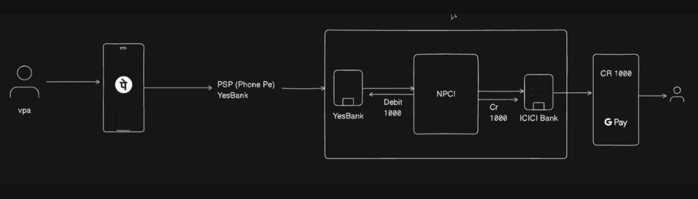

# Case Study: UPI Payments System

---

## Requirements

**Functional**
- Initiate a payment using a Virtual Payment Address (VPA)
- Route payment instructions through the UPI network
- Debit payer account and credit payee account securely
- Support multiple UPI apps and banks interoperably

**Non-Functional**
- Reliability: end-to-end transaction completion or safe failure recovery
- Scale: support millions of payments per minute across banks and apps
- Availability: always-on payment routing with regional resilience
- Latency: sub-second authorization and routing for consumer UX

---

## Constraint Matrix & Capacity Estimation

| Dimension | Target | Notes |
|---|---|---|
| Participants | 100s of banks, 100+ PSPs | Many-to-many interoperability |
| Payment volume | 10M+ txn/day | Peak processing during daytime and festivals |
| Latency | <1 second | Real-time payment expectation |
| Trust boundary | NPCI only trusts banks/CPSPs | UPI apps are not direct peers |
| Data flow | request + settlement | Authorization path separate from clearing path |

**Scale assumptions**
- Each UPI app routes through one or more PSPs.
- NPCI handles message switching and settlement between sponsor/acquiring banks.
- Transaction volumes can spike 5× during events.

---

## Naive Design

```
[User App] ──► [NPCI] ──► [Bank]
```

**Problems**
- NPCI cannot accept direct connections from user apps.
- There is no trust or certification model for every app.
- No separation between app-level onboarding and bank-level settlement.
- Endpoints cannot enforce bank-compliant KYC and liability controls.

---

## Bottlenecks

1. **Trust boundary around NPCI**
   - NPCI only communicates with certified banks and Customer Payment Service Providers (CPSPs). A user app must route through a PSP.
2. **Interoperability complexity**
   - Multiple apps, banks, and VPAs require a central switch to map endpoints and route payments.
3. **Settlement processing**
   - Real-time authorization is separate from clearing/settlement; bulk settlement requires robust reconciliation.
4. **Error handling across domains**
   - Failures can occur at payer bank, NPCI switch, or beneficiary bank; retries and reversals must be coordinated.
5. **Latency in routing**
   - Chaining app → PSP → NPCI → bank → beneficiary app must remain fast enough for a consumer payment flow.

---

## Production Architecture

```
[User]        [UPI App]      [PSP / Sponsor Bank]    [NPCI Network]       [Acquirer Bank]       [Payee App]
  │              │                  │                     │                    │                    │
  │<VPA, PIN>    │                  │                     │                    │                    │
  │───►          │                  │                     │                    │                    │
  │              │──► Payment Req ──▶│                     │                    │                    │
  │              │                  │──► Auth & Routing ──▶│                    │                    │
  │              │                  │                     │──► Debit Request ──▶│                    │
  │              │                  │                     │                    │──► Credit Request ──▶│
  │              │                  │                     │                    │                    │
  │              │                  │                     │◀─Confirmation──────│                    │
  │              │◀─Success/Fail────┘                     │                    │                    │
```



---

## Request Lifecycle

### 1. Payment initiation

- The user enters a VPA and amount in a UPI app.
- The app sends the payment request to its PSP, not directly to NPCI.
- The PSP validates the VPA format, PIN, app authorization, and payer account mapping.
- The PSP constructs a UPI payment message and forwards it to NPCI.

### 2. NPCI routing and authorization

- NPCI receives the request from a trusted PSP.
- NPCI validates the message integrity, checks the sender PSP identity, and resolves the beneficiary VPA.
- NPCI routes the transaction to the beneficiary’s bank or acquiring PSP.
- NPCI acts as a central switch; it does not hold customer funds.

### 3. Bank-level debit and credit

- The payer’s sponsor bank debits the customer account.
- NPCI instructs the beneficiary’s bank to credit the payee account.
- Both banks confirm the transaction back to NPCI.
- NPCI sends the final status to the originating PSP.

### 4. Response to user

- The PSP receives the approval or failure from NPCI.
- The UPI app displays success or failure immediately.
- Settlement and reconciliation occur asynchronously between banks and NPCI.

---

## Component Responsibilities

### User / UPI App

- Collects VPA, amount, and PIN from the user.
- Enforces app-level authorization and biometric/KYC requirements.
- Sends requests only to a registered PSP.

### PSP / Sponsor Bank

- Serves as the trusted entry point to NPCI.
- Maps user VPAs to underlying bank accounts.
- Performs customer authentication and fraud checks.
- Converts app requests into standard UPI messages.

### NPCI Network

- Central clearing and settlement switch for UPI.
- Validates routing, message formats, and PSP trust.
- Maintains directory services for VPAs and bank endpoints.
- Facilitates inter-bank communication and transaction reconciliation.

### Acquirer / Beneficiary Bank

- Receives credit instructions from NPCI.
- Updates the payee account once the debit is confirmed.
- Sends confirmation back through NPCI.

### Recipient UPI App

- Displays transaction status to the payee.
- Can receive real-time notifications when funds are credited.
- Does not communicate with NPCI directly.

---

## Data Model

### Core entities

- `VPA` — Virtual Payment Address, user-facing identifier mapped to a bank account.
- `Transaction` — payment request with amount, payer VPA, payee VPA, timestamp, status.
- `PSP` — registered Payment Service Provider handling one or more apps.
- `Bank Account` — underlying account held at a sponsor or beneficiary bank.
- `Message Envelope` — authenticated UPI request routed through NPCI.

### Why a VPA model?

- VPAs decouple user identifiers from account numbers.
- They enable interoperability across apps and banks.
- NPCI resolves VPAs internally to bank account details while keeping app-layer addresses stable.

---

## Scaling Strategy

### 1. PSP scaling

- Each UPI app uses a PSP to connect to NPCI.
- PSPs horizontally scale API endpoints and transaction routing.
- They cache VPA-to-bank mappings and user auth state to reduce latency.

### 2. NPCI switch scaling

- NPCI acts as a high-throughput message router.
- It shards or partitions traffic by PSP and bank endpoint.
- It maintains fast directory lookups for VPA resolution and endpoint discovery.

### 3. Bank settlement scaling

- Debit/credit operations remain within bank systems.
- NPCI batching and periodic net settlement reduce load.
- Reconciliation is performed asynchronously across clearing cycles.

### 4. Fault isolation

- Failure in one PSP does not disable the entire network.
- NPCI isolates downstream bank failures and returns status codes to the originating PSP.
- Banks retry or reverse payments when required.

---

## Failure Handling

### Payment failure at payer bank

- NPCI receives a decline or timeout.
- The PSP returns failure to the user app with a clear code.
- No credit is attempted at the beneficiary bank.

### Routing failure at NPCI

- NPCI detects malformed requests or unknown PSPs.
- It rejects the transaction before any debit occurs.
- The originating PSP can retry or surface the error.

### Beneficiary bank failure

- If debit succeeds but credit fails, NPCI triggers reversal protocols.
- Banks coordinate through NPCI to restore the payer account.
- The transaction is marked failed and reconciled later.

### Message duplication

- UIDempotency is required for UPI transactions.
- PSPs and NPCI use transaction IDs and idempotency keys to avoid double-debits.
- Duplicate requests return the original transaction result.

---

## Trade-offs

| Decision | Trade-off | Why chosen |
|---|---|---|
| PSP layer between app and NPCI | Extra hop in the user flow | Enforces trust, security, and bank-grade controls |
| Central NPCI switch | Single logical dependency | Enables interoperability and consistent settlement |
| VPA abstraction | Additional resolution step | Simplifies user experience and decouples identity from account details |
| Asynchronous settlement | Delay in clearing funds | Keeps authorization fast while supporting net settlement |
| Bank-only NPCI connectivity | Restricts direct app access | Limits attack surface and ensures regulatory compliance |

---

## Staff-Level Interview Gotchas

### 1. Why can’t the UPI app call NPCI directly?

NPCI only communicates with trusted banking entities and certified PSPs. Direct app connections would bypass bank-level KYC, liability controls, and secure access management.

### 2. What is the role of the PSP?

The PSP is the on-ramp for UPI apps. It authenticates the user, maps the VPA to an account, and forwards requests to NPCI with the proper trust credentials.

### 3. How does NPCI maintain consistency across banks?

NPCI does not hold funds; it acts as a switch and ledger coordinator. It validates each message, routes debit/credit instructions, and supports reconciliation through settlement cycles.

### 4. What happens when a transaction is partially completed?

If debit succeeds and credit fails, reversal protocols are initiated. Wallets and banks use idempotent transaction IDs so retries do not cause duplicate debits.

### 5. How is VPA useful for scaling?

VPAs avoid exposing bank account numbers and let the network route payments based on logical identifiers. This reduces coupling between apps and bank account schemas.

### 6. Why is a central switch needed for UPI?

A central switch provides interoperability across hundreds of PSPs and banks, enforces message standards, and handles routing without requiring each pair of systems to integrate directly.

### 7. Can NPCI process payments if a PSP is down?

Only if the PSP reconnects and resends the request. NPCI cannot process a payment for an app that is not connected through a trusted PSP.

---

## Production Case Study

The UPI architecture is intentionally layered. Apps like PhonePe, GPay, and Paytm are front-ends; NPCI is the central switch; banks are the actual account holders. This separation enables a large, open ecosystem while keeping the trust boundary narrow.

---

## Key Takeaways

- UPI apps never talk to NPCI directly; PSPs provide the trusted bank gateway.
- NPCI is a message switch, not a custodian of funds.
- VPA abstracts bank accounts and enables app interoperability.
- The architecture separates authorization and settlement for performance and reliability.
- Idempotency, reversal logic, and trust boundaries are essential for secure payments.
