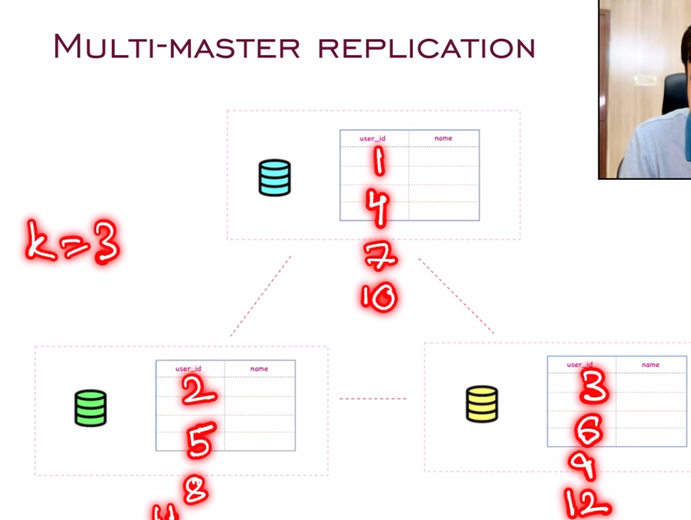
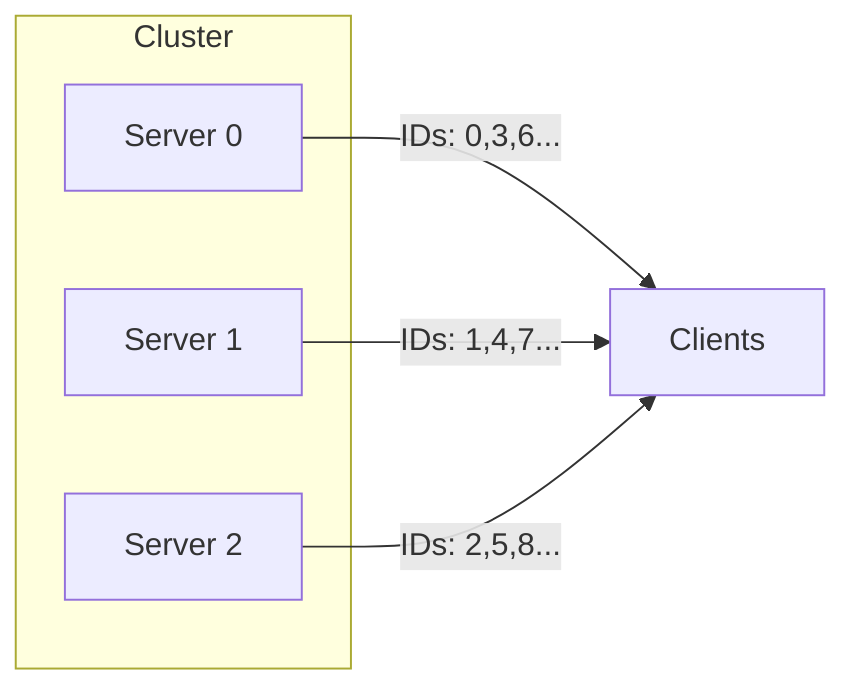
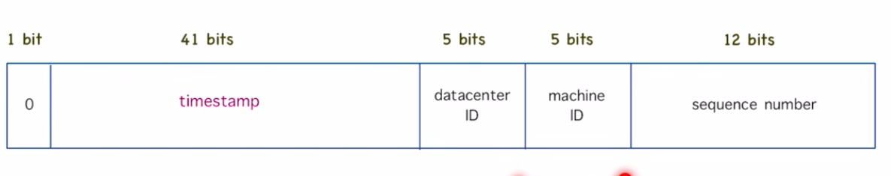
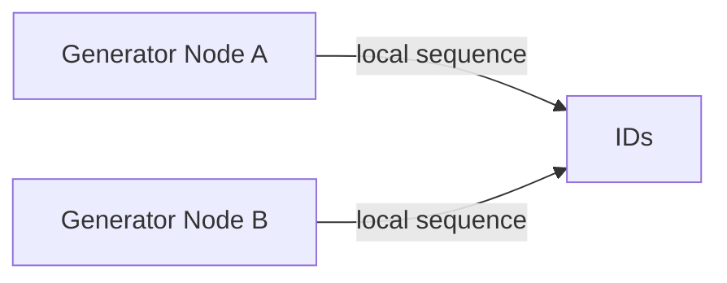

# Case Study: Unique ID Generator

---

## Scope & Motivation

A reliable Unique ID Generator is a small but critical subsystem in distributed systems: social media (post IDs), financial systems (transaction IDs), e‑commerce (order IDs), IoT (device/event IDs). The goal is to produce compact, unique identifiers at high throughput with properties that match application needs (sortable, monotonic, compact, URL-safe, auditable).

This note explains common approaches, trade-offs, production considerations, and when to pick each design.

---

## Requirements (questions you should always answer up front)

- Throughput: how many IDs/sec (average and peak) do you need?
- Size: do IDs need to fit 32-bit, 64-bit, 128-bit, or be variable-length strings?
- Sortability: must IDs be time-sortable? (helps range queries)
- Monotonicity: must later IDs be strictly greater than earlier ones?
- Readability/URL safety: must IDs be human-readable or URL-safe?
- Persistence & audit: must IDs be replayable and traceable to origin node?
- Offline generation: must devices generate IDs while offline?

Always ask these before choosing a design. Different requirements lead to different trade-offs.

---

## Where this is used (examples)

- Social media: tweet/post IDs (high write rate, sortable helps timelines)
- Payments: transaction IDs (strong uniqueness, audit trail, potential regulatory traceability)
- E‑commerce: order IDs (human-friendly, short, and unique)
- IoT: sensor/event IDs (tiny, generated offline, global uniqueness)

---

## Capacity estimation (example targets)

- Small system: 1k IDs/sec — single-server auto-increment can be sufficient.
- Medium: 100k IDs/sec — need sharding or sequence per machine.
- Large / internet-scale: >1M IDs/sec — use Snowflake-like local generators or UUID variants with careful considerations.

---

## Naive approach: single-server auto-increment

```
INSERT INTO users (name, email) VALUES ('Alice', 'alice@example.com');
SELECT LAST_INSERT_ID();
```


The database automatically generates a monotonically increasing ID using an AUTO_INCREMENT/identity column.

Pros
- Simple, consecutive integers, very compact.

Cons
- Single point of failure and bottleneck; cannot scale horizontally without range allocation.

Use only for single-server applications or when strong sequential IDs are required and throughput is low.

---

## 1) Multi-master "stride" (increment-by-k) method



Idea
- Suppose there are `k` servers. Each server i allocates IDs by incrementing by `k` starting at offset `i`.
- e.g., k=3: server0: 0,3,6,... server1:1,4,7,... server2:2,5,8,...

Merits
- Very easy to reason about; no coordination per-id.
- Deterministic and compact integer IDs.

Drawbacks
- Requires stable membership or careful rebalancing when servers are added/removed.
- Hot re-sharding: when `k` changes, ID continuity breaks or requires redistribution.
- If servers are not synchronized, overlap may happen during membership churn.

Mermaid diagram



When to use
- Small clusters with rare topology changes; systems that can coordinate rebalancing.

---

## 2) UUID (Universally Unique IDentifier) methods

Overview
- UUID v4: random 128-bit values
- UUID v1: timestamp + node identifier (MAC) — potential privacy concerns
- UUID v6/v7 proposals: sortable variants (timestamp-first)

Pros
- Easy to scale: any node can generate without coordination.
- Extremely low collision probability when using standard libs.
- Suitable for heterogeneous environments.

Cons
- Long (128-bit) — cost in storage and indexes.
- v4 is not time-sortable; v1 leaks node/MAC info (privacy); newer versions aim to improve sortability.
- Human-unfriendly (alphanumeric, long strings).

When to use
- Systems where absolute decentralization matters and size is less important (logs, traces, document IDs).

---

## 3) Ticker / Central allocation service (single sequencer)

Idea
- A small dedicated service (ticker) hands out sequential IDs or ID ranges on demand.

Pros
- Simple: guarantees strict sequential IDs and easy to audit.
- Clients request a batch to reduce RPC overhead.

Cons
- Single point of failure unless highly replicated.
- Becomes bottleneck at high throughput unless you allocate large batches (which increases potential wastage on failure).

Simple diagram


When to use
- Small systems requiring strictly sequential IDs or central audit where throughput is manageable.

---

## 4) Snowflake (Twitter) — recommended for many distributed systems



Overview
- Typical 64-bit layout (example):
  - 41 bits: timestamp in milliseconds (gives ~69 years)
  - 5 bits: datacenter id
  - 5 bits: machine id
  - 12 bits: sequence number (per ms)

Advantages
- Each node can generate IDs without centralized coordination.
- IDs are time-sortable and compact (64-bit), good for DB indexes and storage.
- High throughput: each node can produce up to 4096 IDs per ms with the example layout.

Example layout (64-bit)

```text
0 - 41 bits timestamp - 5 bits datacenter - 5 bits worker - 12 bits sequence
```

Mermaid diagram (simplified)



Key production considerations
- Clock skew: if system clock moves backward, generator must wait or use a logical counter. Solutions: NTP discipline, monotonic clocks, or bumping sequence with node-level safety checks.
- Sequence overflow: if a node generates more than the sequence limit in the same millisecond, either block until next ms or allocate larger sequence bits.
- Node id assignment: must be unique per node (manual config, DHCP + registration, or a central registry at startup).
- Epoch selection: pick a custom epoch to maximize usable timestamp range.

When to use
- Social media IDs, order IDs, event IDs where sortability and compactness matter.

---

## Comparison table

| Approach | Size | Sortable | SPOF | Scales horizontally | Throughput per node | Use cases |
|---|---:|:---:|:---:|:---:|---:|---|
| Auto-increment (single DB) | 32/64-bit | Yes | Yes | No | low | single‑server apps, small admin tools |
| Multi-master stride | 32/64-bit | Yes (sparse) | No | Limited | medium | small clusters with stable membership |
| UUID (v4) | 128-bit | No (v4) | No | Yes | high | logs, traces, decentralized IDs |
| Ticker (sequencer) | 32/64-bit | Yes | Yes (unless HA) | limited | medium-high (with batching) | audit-sensitive sequential IDs |
| Snowflake | 64-bit | Yes | No (if nodes fail) | Yes | very high | social media, orders, events |

---

## Implementation notes & best practices

- Always reserve node identifiers via a registry (Consul, ZooKeeper, etcd) or pre-provisioned configs.
- Choose bit allocation based on expected lifetime, nodes, and throughput (e.g., bump sequence bits if you expect microservices generating many IDs per ms).
- Use monotonic clocks and detect time regressions. Implement safe waits or use a fallback sequence strategy.
- For financial transactions, add an audit log mapping ID -> generator node + timestamp to simplify forensic analysis.
- Consider hybrid strategies: e.g. Snowflake primary, but use UUIDs for cross-datacenter offline devices.
- For DB primary keys, prefer integer-based (Snowflake) over UUIDs to avoid index bloat and random I/O.
- If you need human-friendly IDs, encode generated 64-bit values in Base62 or short checksummed strings.

---

## Failure modes & mitigations

- Clock rollback at node → risk of duplicate IDs. Mitigation: stop generating until clock moves forward, maintain lastTimestamp and wait. Use NTP and monotonic clocks.
- Node id collision → risk of collisions across nodes. Mitigation: central registry for node IDs; health checks; verify uniqueness on start.
- Sequence exhaustion under burst → block or extend bit width. Pre-allocate batches from a central service if required.
- Network partition during node startup → two nodes may pick same node id if registry is inconsistent. Mitigation: use consensus-backed registry (etcd) or pre-provisioned mapping.

---

## API design suggestions

- `GET /id` → returns a single ID (useful for legacy clients)
- `GET /ids?n=100` → returns `n` IDs in a batch
- Response payload: `{ id: "...", epoch: 1680000000000, node: "us-east-3-12", seq: 42 }` for auditability

Batch allocation reduces RPC overhead for high-throughput clients.

---

## Staff-level interview gotchas

- Clock skew: how would your generator behave if the clock moves backwards? (expect waiting, logical monotonic counters, or NTP-based correction)
- Scalability vs. guarantees: ask whether exactly-once ID issuance is necessary; in most systems at-least-once generation plus dedupe is acceptable.
- Index performance: UUIDs cause random inserts in btree indexes; Snowflake-like monotonic ids are better for write amplification.
- Node reconfiguration: adding/removing nodes changes ID distributions—how will you avoid collisions or wasted ID ranges?

---

## Recommendations (by use case)

- Social media / feeds: **Snowflake** for 64-bit sortable, high throughput IDs.
- Financial transactions: **Snowflake + audit logs** or **central sequencer** if strict sequential IDs are required for regulatory reasons.
- E‑commerce order IDs: Snowflake + Base62 encoding for customer-facing short IDs.
- IoT / offline devices: **UUID v4** or compact device-scoped scheme including device-id + counter (small fixed-length) to tolerate offline generation.

---

## Key takeaways

- Choose ID design based on throughput, size, sortability and audit needs.
- Snowflake-style 64-bit generators provide the best balance for many distributed applications: small, sortable, local generation.
- Avoid single-sequencer unless your throughput is low or you can build a highly available sequencer with batching.
- Always plan for clock issues, node ID assignment, and capacity headroom for sequence bits.

---

