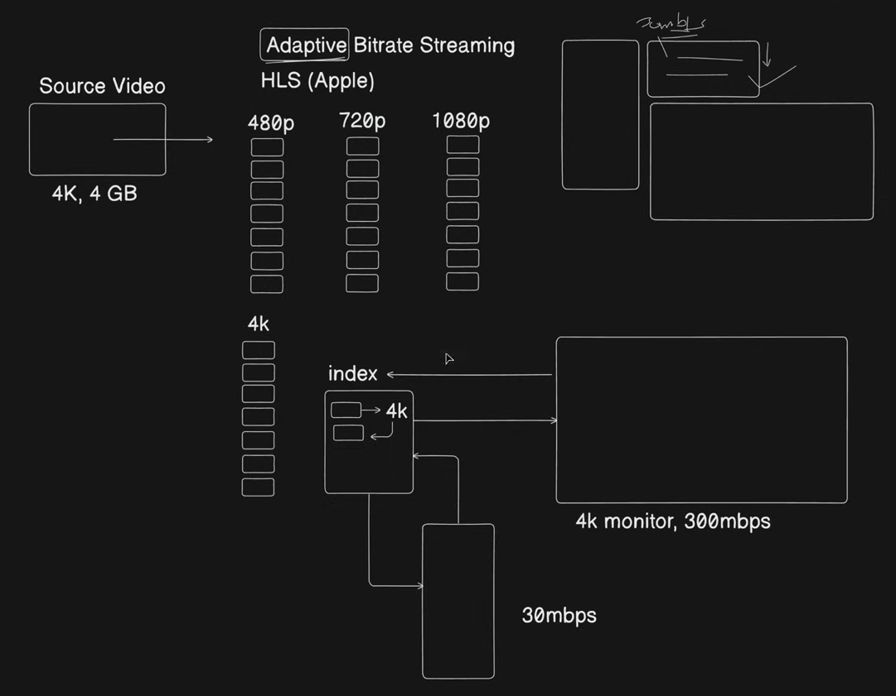

# Case Study: Video Streaming

---

## The Problem with Progressive Download (Old Approach)

```
  Client ──► Server: "Give me video"
  Server ──► Client: Download entire 100MB file first
  Client: Can only watch after full download completes
```

**Problems:**
- Large file sizes (modern videos are GBs) mean long wait times
- If user watches 10% and leaves → 90% of downloaded data is wasted
- Bandwidth wasted on content that was never watched

---

## Streaming — Specialized Protocols

Instead of downloading the whole file, the server sends small **chunks** of video continuously.

| Protocol | Full Name | Use Case |
|---|---|---|
| RTMP | Real Time Messaging Protocol | Live streaming, low latency |
| RTSP | Real Time Streaming Protocol | IP cameras, media servers |

**Benefits over progressive download:**
- Low latency — playback starts within seconds
- Efficient bandwidth use — only watched content is transmitted
- Supports live streaming — content generated in real time

---

## New Problem: Multiple Devices, Multiple Resolutions

A 4K video can be 4GB+. Sending the same file to every device is wasteful and broken:

```
  4K Monitor (300 Mbps) — needs 4K quality
  Laptop     (50 Mbps)  — 1080p is enough
  Mobile     (10 Mbps)  — 480p to avoid buffering
  Smartwatch (2 Mbps)   — 240p
```

Sending full 4K to a mobile on a slow connection → constant buffering → bad experience.

---

## Solution: Adaptive Bitrate Streaming (ABS)

The server **pre-encodes the source video into multiple resolutions and splits each into small time-based chunks** (~2–10 seconds each). The client **continuously monitors its own network speed** and requests the appropriate quality chunk at each step.

```
  Source Video (4K, 4GB)
       │
       ▼
  [Transcoding Pipeline]
       │
       ├──► 240p  chunks: [seg1][seg2][seg3]...
       ├──► 480p  chunks: [seg1][seg2][seg3]...
       ├──► 720p  chunks: [seg1][seg2][seg3]...
       ├──► 1080p chunks: [seg1][seg2][seg3]...
       └──► 4K    chunks: [seg1][seg2][seg3]...
       │
       ▼
  index file (manifest) — lists all available resolutions and segment URLs
```



**How it works at runtime:**

```
  Client fetches index file
       │
  Client reads network speed: 300 Mbps → requests 4K segments
  Network drops to 30 Mbps  → client switches to 720p segments on next chunk
  Network recovers           → client switches back up to 1080p
```

The switch happens per chunk — the user barely notices a quality dip instead of a full buffer.

---

## ABS Protocols

| Protocol | Made By | File Format |
|---|---|---|
| HLS (HTTP Live Streaming) | Apple | `.m3u8` index + `.ts` segments |
| MPEG-DASH | ISO Standard | `.mpd` index + `.m4s` segments |

Both work over plain HTTP — no special server needed, works through CDNs naturally.

### Index File (HLS `.m3u8`)

The index file is what the client downloads first. It tells the player what quality streams are available and where each segment lives:

```
  #EXTM3U
  #EXT-X-STREAM-INF:BANDWIDTH=800000,RESOLUTION=480x270
  480p/segment_%03d.ts

  #EXT-X-STREAM-INF:BANDWIDTH=2000000,RESOLUTION=1280x720
  720p/segment_%03d.ts

  #EXT-X-STREAM-INF:BANDWIDTH=5000000,RESOLUTION=1920x1080
  1080p/segment_%03d.ts

  #EXT-X-STREAM-INF:BANDWIDTH=15000000,RESOLUTION=3840x2160
  4k/segment_%03d.ts
```

Client reads this, checks its current bandwidth, and starts pulling segments from the matching resolution folder.

---

## Implementation with ImageKit

ImageKit handles transcoding and HLS packaging automatically. Append to the original video URL:

```
  Original:
  https://ik.imagekit.io/demo/sample-video.mp4

  HLS with ABR (5 renditions):
  https://ik.imagekit.io/demo/sample-video.mp4/ik-master.m3u8?tr=sr-240_360_480_720_1080
```

ImageKit generates:
- One `.m3u8` master index file
- Separate chunk streams at 240p, 360p, 480p, 720p, 1080p
- No manual transcoding pipeline needed

---

## Role of CDN in Video Streaming

Video chunks are static files once transcoded — perfect for CDN caching.

```
  Client ──► CDN Edge Node (nearest) ──► chunks served locally (fast)
                    │
              Cache MISS ──► Origin Storage (S3/GCS) ──► chunk fetched and cached
```

- CDN absorbs 95%+ of chunk requests — origin barely touched
- Global users get low-latency delivery from the nearest edge node
- Each resolution's chunks are cached independently

---

## Key Takeaways

- Progressive download wastes bandwidth — streaming sends only what is watched
- RTMP/RTSP are streaming protocols optimized for low latency and live content
- Adaptive Bitrate Streaming solves the multi-device problem — one source, many quality levels
- The index file (`.m3u8` / `.mpd`) is the client's map to all available segments
- Client switches quality per chunk based on real-time bandwidth — transparent to the user
- HLS (Apple) and MPEG-DASH are the two dominant ABR protocols — both run over HTTP
- CDN is essential — video chunks are static and cache perfectly at edge nodes
- ImageKit / Cloudinary can handle the entire transcoding + HLS packaging automatically
