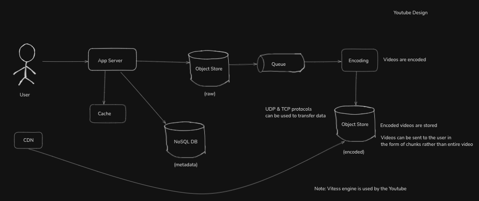

# Case Study: YouTube Design

---

## Requirements

**Functional**
- Upload video files with metadata
- Watch video streams with minimal startup latency
- Serve multiple resolutions and adaptive playback

**Non-Functional**
- Reliability: no loss of uploaded videos, durable storage, recoverable processing
- Scale: 1B daily users, 100:1 read/write ratio, 5 watches/user/day, 50M uploads/day
- Availability: 99.9%+ globally, service must remain responsive during peak traffic
- Latency: minimize startup delay and seek latency for video playback

---

## Constraint Matrix & Capacity Estimation

| Dimension | Target | Notes |
|---|---|---|
| Daily users | 1B | Global scale, many regions |
| Reads | 100× writes | Watch-heavy workload |
| Watch sessions | 5B/day | 5 views per active user |
| Uploads | 50M/day | ~600 uploads/sec average |
| Video size | 500 MB avg | Raw upload size can be several GB |
| Storage growth | PBs/month | Encoded + raw storage both large |

**Traffic assumptions**
- 50M uploads/day → 600 uploads/sec average, 10K/sec peak
- 5B watches/day → 58K/sec average, 300K/sec peak
- Read-heavy ratio implies metadata and catalog lookups dominate traffic

**Storage and bandwidth**
- Raw uploads: 50M × 1 GB = 50 PB/month
- Encoded copies: 50M × 3 GB = 150 PB/month
- CDN egress: massive, hundreds of PB/month depending on hit rate

---

## Naive Design

```
Client ──► App Server
            │
            ├──► Store video in object storage
            ├──► Save metadata in DB
            └──► Directly stream raw video on watch
```

**Problems**
- Upload is blocked until video is available for watching
- Raw storage is not optimized for streaming or multi-resolution playback
- Every watch request hits the origin storage and the database
- No background encoding means high latency and poor user experience

---

## Bottlenecks

1. **Upload processing in request path**
   - Blocking the client until encoding completes increases latency and failure surface.
2. **Raw object storage as origin for playback**
   - Large raw files are inefficient for chunked delivery and adaptive streaming.
3. **Single metadata store overload**
   - Read-heavy workloads can saturate the metadata database if not cached.
4. **Encoding throughput**
   - 50M uploads/day requires hundreds of encoding workers and efficient queueing.
5. **Global delivery latency**
   - Serving users from a central region causes high startup and seek delays.

---

## Production Architecture

```
 [User]                          [CDN]
   │                               ▲
   │                               │
   ▼                               │
[App Server]                       │
   │   ▲                           │
   │   │                           │
   │   │                 ┌─────────┴─────────┐
   │   │                 │  Encoded Videos   │
   │   │                 │  Object Storage   │
   │   │                 └─────────┬─────────┘
   │   │                           │
   │   ├──► [Cache]               │
   │   ├──► [NoSQL Metadata DB]    │
   │   └──► [Raw Object Store]    │
   │                               │
   │                               ▼
   └────────────▶ [Queue] ─────────▶ [Encoding Service]
                                   │
                                   └──────────┐
                                              ▼
                                    [Encoded Object Store]
```



---

## Request Lifecycle

### Upload video

1. Client uploads video to the app server or upload edge.
2. App server stores the raw file in object storage and writes video metadata to NoSQL metadata store.
3. App server pushes a processing event to a queue: `{video_id, user_id, raw_location, metadata}`.
4. App server returns an upload-accepted response immediately.
5. Encoding workers consume queue events asynchronously.
6. Encoded outputs are written back to object storage in multiple resolutions and formats.
7. Metadata is updated with encoded asset locations and processing status.

### Watch video

1. Client requests `GET /watch?video_id=...`.
2. App server consults cache for video metadata and playback manifest.
3. If cache miss, server reads metadata from NoSQL store and populates cache.
4. App server returns playback manifest with CDN URLs for encoded chunks.
5. Client begins streaming from CDN using segmented HTTP requests.
6. CDN serves encoded chunks from edge cache; origin object store is used only on cache misses.

---

## Data Model

### Video metadata

A metadata record stores:
- `video_id`
- `user_id`
- `title`
- `description`
- `upload_timestamp`
- `status` (uploaded, processing, ready)
- `duration`
- `views`
- `likes`
- `encoded_locations` (manifest URLs per resolution)
- `thumbnail_url`
- `access_control`

### NoSQL storage rationale

- Write-heavy upload events are a small fraction of traffic.
- Read-heavy watch operations benefit from wide-column or document stores.
- Secondary indexes on `video_id`, `user_id`, and `status` support common lookup patterns.
- Example: Cassandra for writes, DynamoDB for metadata reads, or MongoDB for flexible schema.

---

## Scaling Strategy

### Upload scaling

- Use **multi-region upload endpoints** to reduce client latency.
- Store raw uploads in **object storage** immediately.
- Decouple encoding by using a **durable queue**.
- Scale encoding fleet horizontally; each worker handles one video stream at a time.
- Use **batching and autoscaling** for encoding workers based on queue depth.

### Playback scaling

- Serve encoded chunks through a **global CDN**.
- Cache metadata at the edge and in app-server-level caches.
- Keep origin metadata store read traffic low by using a **cache hit rate > 95%**.
- Prefer **HTTP chunked streaming** with range requests over long-lived connections.

### Storage scaling

- Raw and encoded assets live in object storage with infinite scale.
- Keep only origin copies of encoded assets; CDN caches serve most traffic.
- Use lifecycle rules to move cold raw uploads to archival storage after a retention period.

### Metadata scaling

- Use **NoSQL tables partitioned by video_id**.
- Cache frequently-read metadata in Redis.
- For global scale, replicate metadata across regions.
- Use **Vitess on MySQL** when stronger relational semantics or joins are needed at massive scale.

---

## Failure Handling

### Upload failure

- If raw upload fails, return a client error and do not enqueue processing.
- If queue enqueue fails, retry with exponential backoff and store the event in a persistent retry buffer.
- Use an upload status field so clients can poll or resume failed uploads.

### Encoding failure

- Encoding jobs may fail due to corrupt input or transient worker issues.
- Move failed jobs to a **dead letter queue** after retries.
- Report processing status to metadata so clients do not attempt playback until ready.

### CDN origin failure

- CDN edge uses origin fallback to object storage.
- If encoded assets are unavailable, return a 503 and retry fetching the manifest from metadata.
- Use multiple origin locations or regional object stores for higher availability.

### Metadata cache miss storm

- Protect against cache stampede with a **distributed lock** or probabilistic early refresh.
- If Redis misses, one app server regenerates and others wait briefly.
- Use TTLs and stale-while-revalidate patterns.

---

## Trade-offs

| Decision | Trade-off | Why chosen |
|---|---|---|
| Queue-based encoding | Upload accepted before video is ready | Keeps upload latency low and avoids blocking users |
| NoSQL metadata | Weaker relational joins | Optimized for 100:1 read/write ratio and flexible schema |
| CDN delivery | Cache invalidation complexity | Reduces egress latency and global load on origin |
| Object storage origin | Higher retrieval latency than local file system | Provides durability and scale for PB-level video assets |
| Encoded chunk storage | Storage duplication vs performance | Enables adaptive streaming and low startup delay |

---

## Staff-Level Interview Gotchas

### 1. Why not stream raw uploads directly?

Raw uploads are large, unoptimized, and often contain a single source resolution. Direct streaming bypasses adaptive bitrate and wastes bandwidth. Video platforms must transcode to multiple resolutions for consistent playback.

### 2. Why use a queue between upload and encoding?

A queue decouples user upload latency from expensive encoding work. It also provides durability, backpressure handling, retry semantics, and capacity smoothing.

### 3. Why NoSQL for metadata instead of relational DB?

Read-heavy workloads with simple key-based access benefit from NoSQL scale. A relational DB can still be used underneath Vitess for stronger consistency when needed, but the general metadata path favors fast reads and flexible schema.

### 4. Can encoding use UDP and TCP together?

Yes. Raw file transfer from ingest to encoder can use TCP for reliability and UDP for RTP-style live streams. For batch transcoding of uploaded files, TCP is more common because asset integrity is required.

### 5. How do you minimize watch latency?

Use a CDN, pre-generate playback manifests, cache metadata, and store encoded chunks in edge-friendly formats. Startup latency is usually dominated by manifest lookup and first chunk retrieval.

### 6. What happens if a user watches before processing completes?

Return a processing state response rather than a playback manifest. The client can poll or receive a notification when the video becomes ready.

### 7. How do you handle global availability?

Replicate metadata regionally, use multi-region upload/streaming endpoints, and leverage a CDN that can fail over to a secondary origin.

---

## Production Case Study

YouTube’s public design emphasizes decoupling upload, storage, and encoding. The platform stores raw uploads in Google Cloud Storage, transcodes to multiple formats, and serves encoded chunks via a global CDN. The metadata layer is heavily cached, and large-scale services like Vitess are used where MySQL semantics are required.

---

## Key Takeaways

- Decouple upload from encoding using asynchronous queueing.
- Use object storage for raw and encoded assets, not the request path.
- Cache metadata aggressively because reads outnumber writes by 100:1.
- Global CDN is mandatory for low-latency video delivery.
- Use a durable queue and retry logic for encoding pipeline reliability.
- Store multiple encoded resolutions to support adaptive streaming and bandwidth variability.

