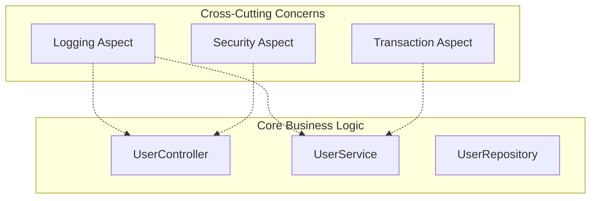
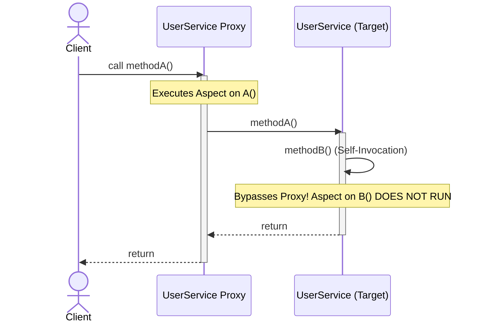

# Aspect-Oriented Programming (AOP) Concepts

---

## 1. What is AOP?

**Aspect-Oriented Programming (AOP)** is a programming paradigm that aims to increase modularity by enabling the separation of **cross-cutting concerns**. 

* **Cross-Cutting Concerns:** These are features or tasks that span across multiple parts (layers/classes) of an application. Examples include:
  * Logging
  * Transaction Management
  * Security and Authentication
  * Exception Handling
  * Auditing
  * Performance Monitoring (Profiling)
* **The Problem:** Without AOP, the code for these concerns is duplicated across every method/class that requires them (known as *code scattering* or *code tangling*). This violates the **DRY (Don't Repeat Yourself)** principle.
* **The Solution:** AOP allows you to modularize these cross-cutting concerns into a single place (an **Aspect**) and inject (weave) them into the execution flow without modifying the original source code.



---

## 2. Terms in AOP

To work effectively with AOP, you need to understand its key terminology:

| Term | Definition | Simple Analogy |
| :--- | :--- | :--- |
| **Aspect** | A modular unit that encapsulates a cross-cutting concern. It contains the logic (Advice) and defines where it applies (Pointcuts). | **Security Guard** (contains security checks). |
| **Join Point** | A specific point during program execution (e.g., method execution, constructor call, exception handling). | **Every doorway** in a building where a guard *could* stand. |
| **Pointcut** | A predicate or expression that matches specific Join Points. It defines *where* the Advice will be executed. | **The list of specific doors** the guard is assigned to watch (e.g., "only external doors"). |
| **Advice** | The action/logic executed by an Aspect at a Join Point. | **Checking ID cards** or logging who enters. |
| **Target Object** | The object being advised by one or more aspects. | **The visitor** entering the building. |
| **AOP Proxy** | A dynamic object created by the framework to intercept method calls and execute aspects before/after/around the target method. | **The turnstile/reception desk** that intercepts visitors before they reach their destination. |
| **Introduction** | Declaring additional methods or fields on behalf of a type. It allows you to add new interfaces/state to existing classes. | Giving a visitor a temporary **access pass** that grants them new roles. |

---

## 3. Advice & Types of Advice

**Advice** is the code/action executed by an aspect. In Java/Spring, advice is associated with a specific Pointcut.

### Types of Advice (with Spring Annotations)

Spring AOP supports five distinct types of advice:

```
                  [Method Execution Starts]
                             │
                      ┌──────▼──────┐
                      │   @Before   │
                      └──────┬──────┘
                             │
                      ┌──────▼──────┐
                      │ Core Method │
                      └──────┬──────┘
                             │
             ┌───────────────┴───────────────┐
             ▼ Normal Return                 ▼ Exception Thrown
     ┌───────────────┐               ┌───────────────┐
     │ @AfterReturning│              │ @AfterThrowing│
     └───────────────┘               └───────────────┘
             │                               │
             └───────────────┬───────────────┘
                             ▼
                      ┌──────────────┐
                      │    @After    │ (Runs regardless of success/fail)
                      └──────────────┘
```

1. **Before Advice (`@Before`)**
   * **When it runs:** Before the target method execution starts.
   * **Note:** It cannot stop the method execution from proceeding unless it throws an exception.
   * **Use Case:** Security checks, basic validation, input logging.

2. **After Returning Advice (`@AfterReturning`)**
   * **When it runs:** Only after the target method successfully completes execution and returns a value.
   * **Note:** You can inspect the returned value within the advice.
   * **Use Case:** Logging successful results, auditing database modifications.

3. **After Throwing Advice (`@AfterThrowing`)**
   * **When it runs:** Only if the target method exits by throwing an exception.
   * **Note:** You can capture and inspect the thrown exception.
   * **Use Case:** Centralized error logging, sending alerts, transaction rollback notifications.

4. **After (Finally) Advice (`@After`)**
   * **When it runs:** Regardless of the target method's outcome (whether it completes successfully or throws an exception).
   * **Note:** Similar to a Java `finally` block.
   * **Use Case:** Releasing system resources, closing database connections, clean-up operations.

5. **Around Advice (`@Around`)**
   * **When it runs:** Surrounds the target method invocation. It executes code *both* before and after the method runs.
   * **Note:** **This is the most powerful advice.** It can control whether the target method runs at all (by calling `ProceedingJoinPoint.proceed()`), modify the return value, or catch exceptions and handle them directly.
   * **Use Case:** Performance profiling (measuring method execution time), caching responses.

---

## 4. Weaving

**Weaving** is the process of linking aspect classes with core application classes to create an advised, proxied object.

There are four primary ways/times to perform weaving:

1. **Compile-Time Weaving**
   * Aspects are woven directly into the Java class files during compilation.
   * Requires a special compiler (e.g., AspectJ's `ajc` compiler).
   * **Pros:** Fastest execution time.

2. **Post-Compile Weaving (Binary Weaving)**
   * Used to weave aspects into existing compiled `.class` files or `.jar` files.
   * Useful when you do not have the source code of the target classes.

3. **Load-Time Weaving (LTW)**
   * Aspects are woven dynamically when the JVM loads the target class files into memory.
   * Requires a Java agent (`-javaagent` JVM argument) to intercept class loading.

4. **Runtime Weaving (Spring AOP)**
   * Aspects are woven during execution by creating a dynamic proxy wrapper around the target object.
   * The actual bytecode files are never modified.
   * **Pros:** Simple to use, standard Java compiler is sufficient.

---

## 5. Spring AOP vs. AspectJ

Java developers typically choose between two primary AOP frameworks: **Spring AOP** (built into the Spring ecosystem) and **AspectJ** (the original, full-featured AOP standard).

### Comparison Table

| Feature | Spring AOP | AspectJ |
| :--- | :--- | :--- |
| **Philosophy / Type** | Proxy-based framework. Pure Java implementation. | Full-fledged AOP framework. Bytecode-manipulation based. |
| **Weaving Mechanism** | **Runtime Weaving** via JDK dynamic proxies or CGLIB proxies. | **Compile-Time, Post-Compile, or Load-Time Weaving**. |
| **Join Point Support** | **Method-level only**. Can only intercept public methods of Spring-managed beans. | **All Join Points**. Intercepts method executions, constructor calls, field reads/writes, static initializers, etc. |
| **Performance** | **Slower.** Incurs runtime proxy creation and invocation overhead. | **Faster.** Direct bytecode execution with no runtime proxy overhead. |
| **Target Objects** | Can only advise beans registered in the Spring Container. | Can advise any Java object (even if created using the `new` operator). |
| **Compiler Requirement** | Standard Java compiler (`javac`). | AspectJ compiler (`ajc`) is required for compile-time/post-compile weaving. |
| **Complexity** | **Very Simple.** Easy to configure, low learning curve. | **Higher.** Requires configuring build tools (Maven/Gradle plugins) or JVM agents. |

> [!TIP]
> **Which one should you use?**
> * Use **Spring AOP** for most web applications where you only need to advise Spring controller/service beans (e.g., logging, basic transaction management, security checks).
> * Use **AspectJ** if you need high-performance overhead reduction, want to advise objects created with `new`, or require non-method join points (like field access or constructor execution).

---

## 6. Aspect Ordering (Controlling Aspect Execution Order)

When multiple aspects are applied to the same join point (e.g., advising the same method), Spring AOP executes them in an **undefined order** by default. To control the sequence in which these aspects run, Spring provides the `@Order` annotation (from the `org.springframework.core.annotation` package).

### How to Use `@Order`
Annotate the aspect class with `@Order` and provide an integer value.

```java
import org.springframework.core.annotation.Order;
import org.aspectj.lang.annotation.Aspect;
import org.springframework.stereotype.Component;

@Aspect
@Component
@Order(1)
public class SecurityAspect {
    // Advice methods here (runs first on the way in, last on the way out)
}

@Aspect
@Component
@Order(2)
public class LoggingAspect {
    // Advice methods here (runs second on the way in, first on the way out)
}
```

### Precedence Rules

1. **Lower Numbers Have Higher Precedence:** The aspect with the lowest order value executes first when entering the target method.
   * `Ordered.HIGHEST_PRECEDENCE` (value: `Integer.MIN_VALUE`) has the highest precedence.
   * `Ordered.LOWEST_PRECEDENCE` (value: `Integer.MAX_VALUE`) has the lowest precedence.
2. **On the Way In (Before/Around-before advice):** 
   * Aspects run in **ascending order** (lowest number first).
   * In the example above: `SecurityAspect` (`Order(1)`) executes before `LoggingAspect` (`Order(2)`).
3. **On the Way Out (After/AfterReturning/AfterThrowing/Around-after advice):**
   * Aspects run in **descending order** (highest number first).
   * This forms a nested, onion-skin execution pattern:
     ```
      [Method Call]
           │
           ├──> SecurityAspect (Order 1) - Before
           │         │
           │         ├──> LoggingAspect (Order 2) - Before
           │         │         │
           │         │         ▼
           │         │    Target Method
           │         │         │
           │         ├──< LoggingAspect (Order 2) - After
           │         │
           └──< SecurityAspect (Order 1) - After
      ```

---

## 7. Working with JoinPoints (`JoinPoint` & `ProceedingJoinPoint`)

When writing advice, you often need metadata about the method being executed (e.g., its name, parameter names, or argument values). Spring AOP allows you to inject a `JoinPoint` object as a parameter in your advice methods.

### 1. `JoinPoint` Interface
For `@Before`, `@After`, `@AfterReturning`, and `@AfterThrowing` advice, you can declare `org.aspectj.lang.JoinPoint` as the first parameter.

#### Common Methods
* **`getSignature()`**: Returns the method signature. Usually cast to `org.aspectj.lang.reflect.MethodSignature` to get detailed info (e.g., return type, parameter names, parameter types).
* **`getArgs()`**: Returns an array of method arguments (`Object[]`).
* **`getTarget()`**: Returns the target object (the original service/controller class being proxied).
* **`getThis()`**: Returns the AOP proxy object itself.

#### Example Usage
```java
import org.aspectj.lang.JoinPoint;
import org.aspectj.lang.annotation.Aspect;
import org.aspectj.lang.annotation.Before;
import org.aspectj.lang.reflect.MethodSignature;
import org.springframework.stereotype.Component;

import java.util.Arrays;

@Aspect
@Component
public class LoggingAspect {

    @Before("execution(* com.example.service.*.*(..))")
    public void logMethodCall(JoinPoint joinPoint) {
        // 1. Get Method Signature
        MethodSignature methodSignature = (MethodSignature) joinPoint.getSignature();
        System.out.println("Method signature: " + methodSignature);
        System.out.println("Method name: " + methodSignature.getName());
        
        // 2. Get Method Arguments
        Object[] args = joinPoint.getArgs();
        System.out.println("Arguments: " + Arrays.toString(args));
        
        // Loop through args
        for (Object arg : args) {
            System.out.println("Arg: " + arg);
        }
    }
}
```

### 2. `ProceedingJoinPoint`
For `@Around` advice, you **must** use `org.aspectj.lang.ProceedingJoinPoint` (which extends `JoinPoint`). It exposes the critical methods to proceed with the execution flow.

#### Additional Methods
* **`proceed()`**: Executes the next advice in the chain or the target method itself, returning its return value.
* **`proceed(Object[] args)`**: Executes the target method but overrides the original arguments with a new set of arguments.

#### Example Usage
```java
import org.aspectj.lang.ProceedingJoinPoint;
import org.aspectj.lang.annotation.Around;
import org.aspectj.lang.annotation.Aspect;
import org.springframework.stereotype.Component;

@Aspect
@Component
public class PerformanceAspect {

    @Around("execution(* com.example.service.*.*(..))")
    public Object profileMethod(ProceedingJoinPoint proceedingJoinPoint) throws Throwable {
        long start = System.currentTimeMillis();
        
        // Proceed with target method execution
        Object result = proceedingJoinPoint.proceed();
        
        long duration = System.currentTimeMillis() - start;
        System.out.println(proceedingJoinPoint.getSignature().toShortString() 
                + " executed in " + duration + " ms");
        
        return result;
    }
}
```

---

## 8. Pointcut Expressions & Wildcard Patterns

Pointcut expressions define where your advice should run. They use AspectJ's pointcut designator (PCD) syntax, with `execution` being the most commonly used designator in Spring AOP.

### Pointcut Expression Structure
```
execution(modifiers-pattern? ret-type-pattern declaring-type-pattern? name-pattern(param-pattern) throws-pattern?)
```
* **`modifiers-pattern?`**: Optional. E.g., `public`, `protected`.
* **`ret-type-pattern`**: Required. The return type of the method (e.g., `void`, `String`, `*` for any type).
* **`declaring-type-pattern?`**: Optional. The fully-qualified package/class name (e.g., `com.aadi.aop.dao.AccountDAO`).
* **`name-pattern`**: Required. The method name pattern (e.g., `addAccount`, `add*`, `*`).
* **`param-pattern`**: Required. The method parameter list pattern (enclosed in parentheses).
* **`throws-pattern?`**: Optional. The exception types thrown by the method.

### Wildcard Symbols
* **`*`**: Matches any single element (e.g., any return type, any method name prefix, any package segment).
* **`..`**: 
  * In package patterns: Matches the package and all sub-packages.
  * In parameter patterns: Matches zero or more arguments of any type.

### Practical Examples
| Pointcut Expression | Matches |
| :--- | :--- |
| `execution(public void addAccount())` | Any public method named `addAccount()` returning `void` with no arguments, anywhere in the app. |
| `execution(* addAccount())` | Any method named `addAccount()` returning any type with no arguments. |
| `execution(* add*())` | Any method starting with `add` returning any type with no arguments. |
| `execution(* com.aadi.aop.dao.*.*(..))` | Any method inside the `com.aadi.aop.dao` package, regardless of class, method name, return type, or parameter count. |
| `execution(* com.aadi.aop..*.*(..))` | Any method inside the `com.aadi.aop` package or any of its sub-packages. |

---

## 9. Declaring Pointcuts & Combining Expressions (`@Pointcut`)

If you want to apply the same pointcut expression to multiple advice methods, you can declare it once using the `@Pointcut` annotation on a dummy (empty body) method and reference that method instead. This makes your aspects cleaner and easier to maintain.

### Combining Pointcuts with Logical Operators
You can combine multiple pointcut expressions using:
* **`&&` (AND)**: Matches if both pointcuts match.
* **`||` (OR)**: Matches if either pointcut matches.
* **`!` (NOT)**: Matches if the pointcut does not match.

### Example: Excluding Getters and Setters
This is a standard real-world pattern. You want to advise all methods in a package *except* getters and setters to avoid log clutter.

```java
package com.aadi.aop.aspect;

import org.aspectj.lang.annotation.Aspect;
import org.aspectj.lang.annotation.Before;
import org.aspectj.lang.annotation.Pointcut;
import org.springframework.stereotype.Component;

@Aspect
@Component
public class MyLoggingAspect {

    // 1. Pointcut matching all methods in the DAO package
    @Pointcut("execution(* com.aadi.aop.dao.*.*(..))")
    private void forDaoPackage() {}

    // 2. Pointcut matching all getter methods (methods starting with 'get')
    @Pointcut("execution(* com.aadi.aop.dao.*.get*(..))")
    private void getter() {}

    // 3. Pointcut matching all setter methods (methods starting with 'set')
    @Pointcut("execution(* com.aadi.aop.dao.*.set*(..))")
    private void setter() {}

    // 4. Combined pointcut: DAO package, excluding getters and setters
    @Pointcut("forDaoPackage() && !(getter() || setter())")
    private void forDaoPackageNoGetterSetter() {}

    // Apply the combined pointcut to advices
    @Before("forDaoPackageNoGetterSetter()")
    public void performApiAnalytics() {
        System.out.println("==>>> Performing API Analytics (excluding getters/setters)");
    }
}
```

---

## 10. Detailed Advice Behaviors & Exception Handling

AOP offers fine-grained control over how return values and exceptions are intercepted, processed, or suppressed.

### A. `@AfterReturning` (Success Interceptor)
* Runs **only** when the target method completes successfully.
* Uses the `returning` attribute to map the return value to a parameter in your advice method.
* **Warning:** While you can inspect the return value or modify the state of mutable objects (e.g., clearing or sorting a list), you **cannot** change the object reference returned to the caller.

```java
@AfterReturning(
    pointcut = "execution(* com.aadi.aop.dao.AccountDAO.findAccounts(..))",
    returning = "result"
)
public void afterReturningFindAccountsAdvice(JoinPoint joinPoint, List<Account> result) {
    // Process or audit the result
    System.out.println("Auditing retrieved accounts: " + result);
}
```

### B. `@AfterThrowing` (Exception Interceptor)
* Runs **only** if the target method throws an exception.
* Uses the `throwing` attribute to map the thrown exception to a parameter in your advice method.
* **Warning:** The exception is still propagated to the caller! The advice acts only as a hook for logging/auditing, it does not swallow the exception.

```java
@AfterThrowing(
    pointcut = "execution(* com.aadi.aop.dao.AccountDAO.findAccounts(..))",
    throwing = "theExc"
)
public void afterThrowingFindAccountsAdvice(JoinPoint joinPoint, Throwable theExc) {
    System.err.println("Method threw exception: " + theExc.getMessage());
}
```

### C. `@After` (Finally Interceptor)
* Runs **regardless** of whether the method completes successfully or throws an exception.
* Analogous to a standard Java `finally` block.
* Often used to release resources (db connections, file handles, etc.).

### D. `@Around` (Full Interception & Exception Suppression)
`@Around` is the most powerful advice because it can:
1. Control whether the target method executes or not.
2. Modify input parameters before invoking the method.
3. Catch, swallow, log, or rethrow exceptions.
4. Modify the final return value.

#### Suppressing/Swallowing an Exception
If the target method throws an exception, `@Around` can catch it and return a default/fallback value instead of propagating the error.

```java
@Around("execution(* com.aadi.aop.service.TrafficFortuneService.getFortune(..))")
public Object aroundGetFortune(ProceedingJoinPoint proceedingJoinPoint) {
    try {
        // Proceed with method execution
        return proceedingJoinPoint.proceed();
    } catch (Throwable e) {
        System.err.println("Target method failed: " + e.getMessage());
        // Swallow exception and return a fallback value
        return "Expect moderate traffic (fallback due to API failure)";
    }
}
```

#### Modifying Arguments
You can intercept and modify the parameters passed to the target method.

```java
@Around("execution(* com.aadi.aop.dao.AccountDAO.addAccount(..))")
public Object aroundAddAccount(ProceedingJoinPoint proceedingJoinPoint) throws Throwable {
    Object[] args = proceedingJoinPoint.getArgs();
    
    // Modify parameter if it is an Account object
    for (int i = 0; i < args.length; i++) {
        if (args[i] instanceof Account) {
            Account account = (Account) args[i];
            account.setName(account.getName().toUpperCase()); // Uppercase name
        }
    }
    
    // Proceed with modified arguments
    return proceedingJoinPoint.proceed(args);
}
```

---

## 11. Self-Invocation / Local Method Call Issue (Proxy Bypass)

A common pitfall in Spring AOP is the **Self-Invocation Issue**.

### The Problem
Spring AOP is **proxy-based**. When you autowire a bean, Spring injects a dynamic proxy wrapper around the bean. The aspect logic runs because calls go through the proxy.
However, if method `A()` calls method `B()` **within the same class** (e.g., using `this.B()`), the call bypasses the proxy and executes directly on the target object. Consequently, any aspects configured on `B()` will **not** execute.



### The Solutions
1. **Refactoring (Recommended)**: Move method `B()` to a different bean so that the call must pass through the Spring proxy.
2. **Self-Injection**: Inject the bean into itself using `@Autowired` or constructor injection and call the method via the injected instance.
   ```java
   @Service
   public class MyService {
       @Autowired
       private MyService self; // Self-inject to invoke proxy
       
       public void methodA() {
           self.methodB(); // This runs aspects on methodB!
       }
       
       public void methodB() { ... }
   }
   ```
3. **Using `AopContext.currentProxy()`**: Retrieve the current active proxy dynamically. (Requires adding `@EnableAspectJAutoProxy(exposeProxy = true)`).
   ```java
   public void methodA() {
       ((MyService) AopContext.currentProxy()).methodB();
   }
   ```

```


